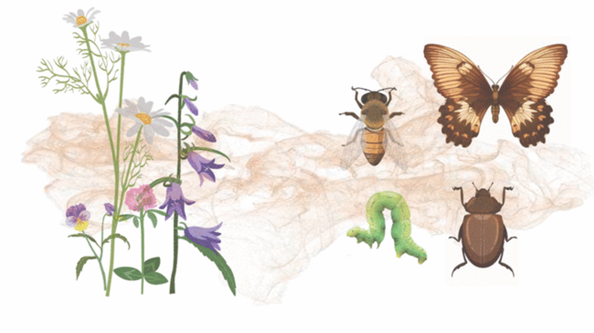

## Activity · Activité {background-color="#1B4332" data-agenda-section="Activity"}

### 🌿 🐛 Plants and insects
*Plantes et insectes*

<!-- TODO: replace this text placeholder with a real photo once you
have one — drop the file into images/ and use:
{width="70%" fig-align="center"}
See README.md ("Adding pictures to a slide") for details. -->

{width="70%" fig-align="center"}

> **How might a plant and an insect "talk" to each other without words?**
>
> *Comment une plante et un insecte pourraient-ils « se parler » sans mots ?*

::: {.notes}
EN: Before we open a single slide, let's try something together.
FR: Avant de commencer, nous allons essayer quelque chose ensemble.

EN: Everyone, close your eyes.
FR: Fermons les yeux.EN: 

Now — imagine you are a plant. You are rooted to the ground. You cannot move. You cannot speak. You cannot see.
FR: Maintenant, imaginons : on est des plantes. Nos racines sont dans la terre. On ne peut pas bouger. On ne peut pas parler. On ne peut pas voir.

EN: (pause) Are you all plants now? Good — notice, you can't even say "yes" out loud.
FR: (pause) On est tous des plantes maintenant ? Bien — on ne peut même pas dire « oui » à voix haute.

EN: Now think about where your leaf is growing. Maybe it's your hand. Maybe it's your shoulder.
FR: Pensons : où pousse notre feuille ? Peut-être sur notre main. Peut-être sur notre épaule.

EN: Okay. Right now, a caterpillar is chewing on that leaf. Bite. By bite. By bite.
FR: Maintenant, une chenille mange cette feuille. Une bouchée. Puis une autre. Puis une autre.

EN: What can you possibly do?
FR: Qu'est-ce qu'on peut faire ?

EN: (a few seconds of silence)
FR: (quelques secondes de silence)

EN: Now — open your eyes.
FR: Maintenant, ouvrons les yeux.

EN: This time, you are an insect. How would you find your host plant? How would you find a mate? How would you avoid becoming someone else's lunch?
FR: Cette fois, vous êtes un insecte. Comment trouvez-vous votre plante-hôte ? Comment trouvez-vous un partenaire ? Comment évitez-vous d'être mangé par un prédateur ?
:::
