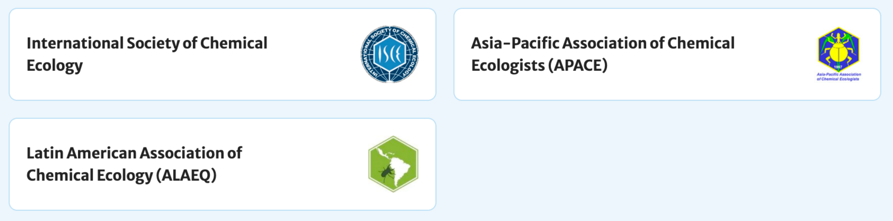

## What is Chemical Ecology {background-color="#1B4332" data-agenda-section="What is Chemical Ecology"}

### Qu'est-ce que l'écologie chimique ?

::: {.notes}
Transition into the definition/history/resources block, ~5 sec.
:::

## Definition

> **Chemical ecology** is a vast and interdisciplinary field utilizing
> biochemistry, biology, ecology, and organic chemistry for explaining
> observed interactions of living things and their environment through
> chemical compounds (e.g. ecosystem resilience and biodiversity).

*Source: [Wikipedia, "Chemical ecology"](https://en.wikipedia.org/wiki/Chemical_ecology)*

::: {.notes}
~1 min. This is the field-level definition — the three stories we just
saw are concrete instances of exactly this.
:::

## A brief history

- **1950s–1970s**: pioneering work in insect pheromones and plant
  secondary metabolites — you just saw some founding discoveries
  in the stories above
- Rise of **multidisciplinary research**, combining biology and
  chemistry into a single field

## Interdisciplinary core

*Un socle interdisciplinaire*

Chemical ecology draws on:

- **Chemistry** — structure, synthesis, and analysis of natural products
- **Ecology** — behavior, interactions, ecosystems
- **Evolutionary biology** — coevolution, adaptation
- **Entomology** — insects as central model systems
- **Plant biology** — defenses, signaling, mutualisms
- **Neuroscience & physiology** — how chemical signals are detected
- **Mathematics, physics, computer science** — modeling, complex
  systems, networks

::: {.notes}
~1 min. Point back at the stories again: Fabre (natural history) to
GC-MS/GC-EAD (chemistry + neurophysiology) is literally this list in
miniature.
:::

## Resources: societies & journals

*Ressources : sociétés savantes et revues*

- **International Society of Chemical Ecology (ISCE)** — founded 1983,
  publishes the **Journal of Chemical Ecology**; annual meetings rotate
  globally
- Regional societies: **APACE** (Asia-Pacific), **ALAEQ** (Latin
  America), **ECE** (Europe)
- Chemical ecology research also regularly appears in general ecology
  and evolution journals (*Ecology Letters*, *Trends in Ecology &
  Evolution*, *Nature Ecology & Evolution*, and others)

{width="90%" fig-align="center"}

::: {.notes}
~1 min. Point out these exist mainly so students know where to look
later (e.g. for a term paper), not to memorize.
:::

## Neuchâtel as a hub

*Neuchâtel, un pôle de l'écologie chimique*

- A global hub for chemical ecology, founded by **Prof. Ted Turlings**
  and others in the 1990s (Focus: insect–plant interactions, volatiles, biological control)
- **FARCE**: Home of the Laboratory of Fundamental and Applied Research in
  Chemical Ecology
- **NICE**: Home of the Laboratory of Network, Information & Chemical Ecology (NICE) —
  [informationecology.github.io/research](https://informationecology.github.io/research/)
- [**NPAC**](https://www.unine.ch/npac/), the Neuchâtel Platform for
  Analytical Chemistry (LC-MS, NMR, and more)

**You are part of a living tradition that shaped the global field.**

::: {.notes}
~1-1.5 min. This is meant to be motivating, not just informational —
they're studying this in the actual place a lot of it was built.
:::

## Today's learning goals: {background-color="#1B4332"}

- Explain what chemical ecology is and why it's interdisciplinary
- Describe the history of the field through three real discoveries
- Start your chemical ecology observations

::: {.notes}
~30 sec. Short, punchy recap before moving into course logistics.
:::
