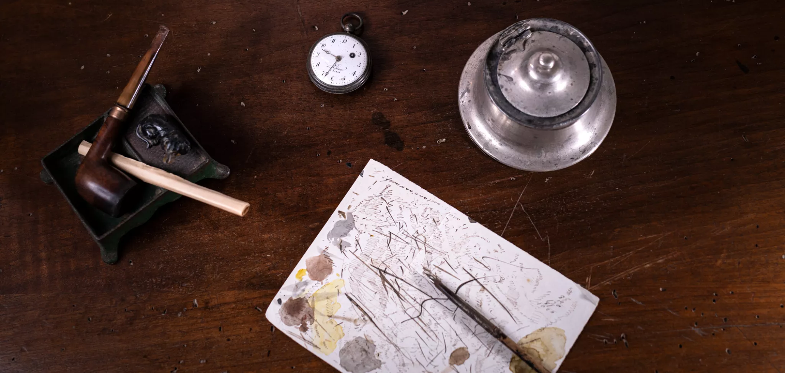

## Today: three true detective stories {background-color="#1B4332"}

*Aujourd'hui : trois vraies histoires de détective*

Each story starts with a question — think before I reveal the answer.

::: {.notes}
Frame the session. Three short history stories, ~9 min each, each with a
pause where students think before the reveal. Total session ~30 min.
:::

## A preview

| Story | Question | Years |
|---|---|---|
| 1 · Pheromones | A scent no one could see | 1879 – 1975 |
| 2 · HIPV | Why would a plant call for help? | 1959 – 1990 |
| 3 · Flower deception | When a flower lies | 1927 – today |

::: {.notes}
~1.5–2 min total for the two intro slides.
:::
