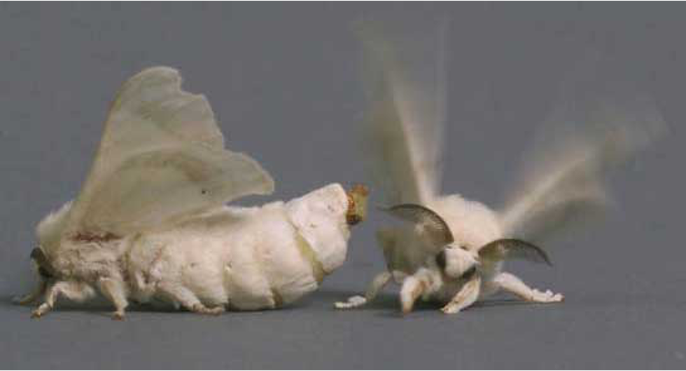
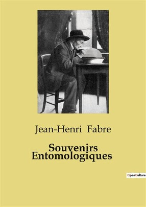
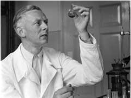
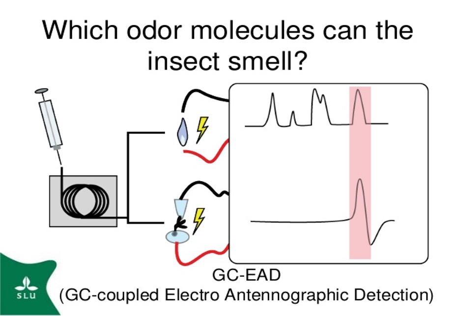

## Story 1 · Histoire 1 {background-color="#1B4332"}

### The Scent No One Could See
*L'odeur invisible*

{width="40%" fig-align="center"}

::: {.notes}
Transition, ~5 sec. Timing target for Story 1: ~9 minutes.
:::

## 1879 · Sérignan, France {.hook}

A naturalist keeps a newly-emerged female moth caged in his study. That
night, dozens of males pour in through the open window.

> **How does a male moth find a female — kilometers away, in total darkness?**
>
> *Comment un papillon mâle trouve-t-il une femelle, à des kilomètres, dans le noir total ?*

⏳ Think and discuss with your neighbors.

::: {.notes}
Read the setting, then the question, then actually pause ~60 sec. Let a
couple of students guess before revealing. This naturalist is Jean-Henri
Fabre — save the name for the reveal.
:::

## Fabre & His Great Peacock Day

:::: {.columns}
::: {.column width="50%"}
{width="70%" fig-align="center"}
:::
::: {.column width="50%"}
{width="80%" fig-align="center"}
:::
::::

## Manipulated experiments

::: {.incremental}
- He moved her to other rooms with a not-airtight box → **males still arrived**
- He moved her into a sealed, airtight box → **no males arrived**, even
  with the box left in plain view
- He surrounded her with naphthalene (strong odor) to mask her scent → the
  males found her anyway
:::

::: {.fragment}
> "It must be an odor — one that we cannot perceive."
:::

::: {.fragment}
### What is the odor? Fabre didn't know.
:::

::: {.notes}
Fabre, French naturalist, working at his home. The sealed-box result is
the strongest evidence — lead with that if time is short. The antennae
story is a nice honesty-in-science moment: even Fabre's own experiment
was ambiguous, and he said so himself. Bonus fact if there's time: he
first wondered if the female used a kind of "wireless telegraphy"
(electromagnetic waves) before the smell explanation.
:::

## 60 years later, a Nobel laureate takes the case

:::: {.columns}
::: {.column width="65%"}
- 1939 — **Adolf Butenandt** wins the Nobel Prize in Chemistry, for isolating
  **human** sex hormones. Nothing to do with insects — yet.
- He turns to Fabre's puzzle using silkworm moth, to study what is the odor?
- It takes his team **20** years to gather enough material to identify it.
:::
::: {.column width="30%"}
{width="100%" fig-align="center"}
:::
::::

::: {.notes}
Nice twist: he already had science's highest prize, for completely
different work, before starting this 20-year side quest.
Guess how many moths individuals he gathered for extraction?
:::

## 1959 The first pheromone ever chemically identified 

:::: {.columns}
::: {.column width="40%"}
{width="100%" fig-align="left"}

**20 years · over 500,000 moths · for 6.4mg of bombykol**

**The word "pheromone" is coined that same year.**

:::
::: {.column width="60%"}
{width="50%" fig-align="center"}

He used a "wing-beat" bioassay to determine the biological activity of the extract and confirm the identification.

*Il a utilisé un bio-essai « battements d’ailes » pour déterminer l’activité biologique de l’extrait et confirmer l’identification.*

:::
::::

::: {.notes}
Big payoff moment — let it sit for a second before moving on.
:::

<!--
## Quick pause {.hook}

> **Today, could we do this with just one moth?**
>
> *Aujourd'hui, pourrait-on le faire avec un seul papillon ?*

⏳ 30 seconds.
-->

## Modern technology
**GC-EAD** (Gas Chromatography-Electro Antennographic Detection)  
— the breakthrough made in Switzerland  
— wires a living insect antenna up as a detector on a gas chromatograph

:::: {.columns}

::: {.column width="40%"}
{width="80%" fig-align="center"}
:::
::: {.column width="60%"}
- The insect itself "tells you" which compound it can smell, peak by peak
- Paired with GC-MS to confirm the exact molecular structure, from a
  trace air sample
:::
::::

**Need only one living antenna**

::: {.notes}
GC-EAD = gas chromatography-electroantennographic detection, invented by
Arn, Städler & Rauscher. End of Story 1 (~9 min total).
:::
