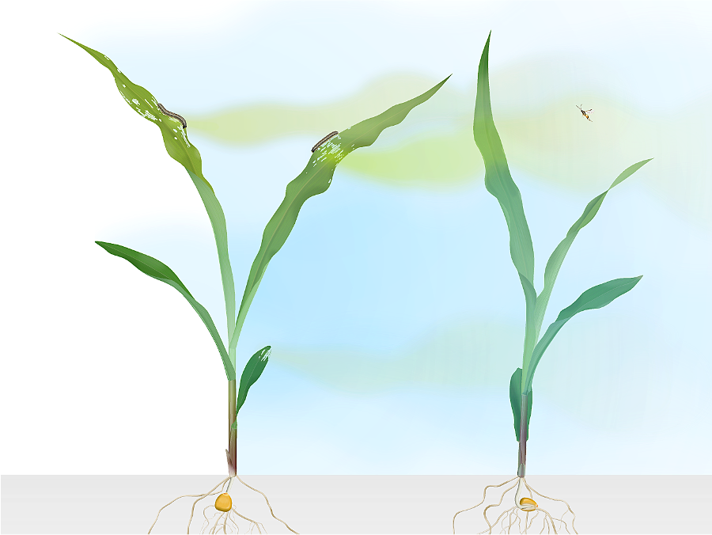
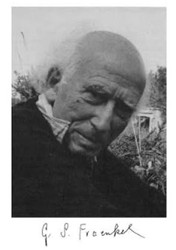
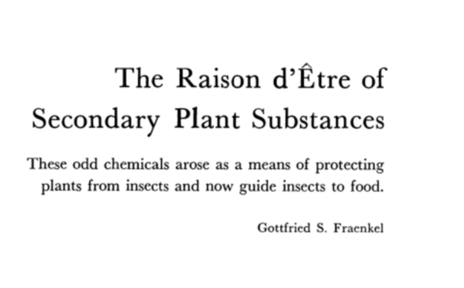

## Story 2 · Histoire 2 {background-color="#1B4332"}

### Plant secondary metabolites: From waste to weapons
*Métabolites secondaires des plantes : du déchet à l'arme*

{width="50%" fig-align="center"}

::: {.notes}
Remember our opening "you are a plant" activity
our 2nd story is about plant, their enemy, and their enemy's enemy.
:::

## Plant metabolic waste? {.hook}

For a century, scientists looked at plant chemicals like nicotine,
caffeine, and morphine, and mostly called them one thing: waste.

> **Why might they have thought that?**
>
> *Pourquoi le pensaient-ils, selon vous ?*

::: {.notes}
Let students guess — common answers: "they don't help the plant grow,"
"random byproducts of metabolism." Both reasonable, both wrong — that's
the point.
:::

## The "waste" assumption

- Plants make thousands of chemically *odd* compounds
- None seemed necessary for growth, photosynthesis, or reproduction
- Biochemists' default explanation: leftover, metabolic "waste"

::: {.notes}
Set up the wrong idea clearly before knocking it down — that's the whole
rhetorical structure of this story.
:::

## 1959 Fraenkel reframes plant chemistry: not waste — weapons.

*"The Raison d'Être of Secondary Plant Substances," Science, 1959 — the
same year as bombykol.*

:::: {.columns}
::: {.column width="70%"}
Reasoning:

- Diverse and specific — not universal across plants, not universal in
  their impact on insects
- Metabolically costly to produce and maintain
- **→ Functional hypothesis**: these are evolved functional traits (defense,
  and — as you'll see next — attracting allies too), not waste
:::
::: {.column width="30%"}

{width="50%" fig-align="center"}

{width="80%" fig-align="center"}

:::
::::

::: {.notes}
Point out the same-year coincidence with Story 1 explicitly — students
often catch it themselves, let them.
:::

## 

### Some plant secondary metabolites can deter a herbivore directly.

> **Can a plant fight back by calling for help?**
>
> *Une plante peut-elle riposter en appelant à l'aide ?*

{width="60%" fig-align="center"}

## Turlings, Tumlinson & Lewis, 1990

:::: {.columns}
::: {.column width="60%"}
- A caterpillar bites into a maize seedling
- Within hours, the plant releases a specific blend of terpenoid volatiles
- A parasitic wasp (*Cotesia*) follows that scent straight to the
  caterpillar — and lays its eggs inside it
:::
::: {.column width="40%"}
{width="90%" fig-align="center"}
:::
::::

:::: {.columns}
::: {.column width="60%"}
**The plant doesn't just defend itself — it recruits a bodyguard.**
:::
::: {.column width="40%"}
{width="90%" fig-align="center"}
:::
::::

::: {.notes}
This is the HIPV (herbivore-induced plant volatile) discovery — the
foundational tritrophic-interaction paper.
:::

## A tradition built right here

This discovery became the HIPV research tradition (herbivore-induced
plant volatiles) and tritrophic interactions — that Ted Turlings later
built at the University of Neuchâtel.

:::: {.columns}
::: {.column width="50%"}
![[[FARCE group]](https://www.unine.ch/farce/)](images/FARCE.png){width="70%" fig-align="center"}
::: 
::: {.column width="50%"}
![[[NICE group]](https://www.unine.ch/chemical-ecology/)](images/NICE.png){width="70%" fig-align="center"}
:::
::::

And now, we carry that torch forward in chemical ecology research.

::: {.notes}
Local pride moment — UniNE is where this research tradition lives on.
Good bridge into Story 3. End of Story 2 (~9 min total).
:::
