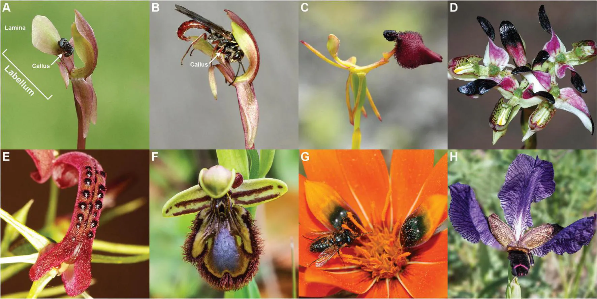
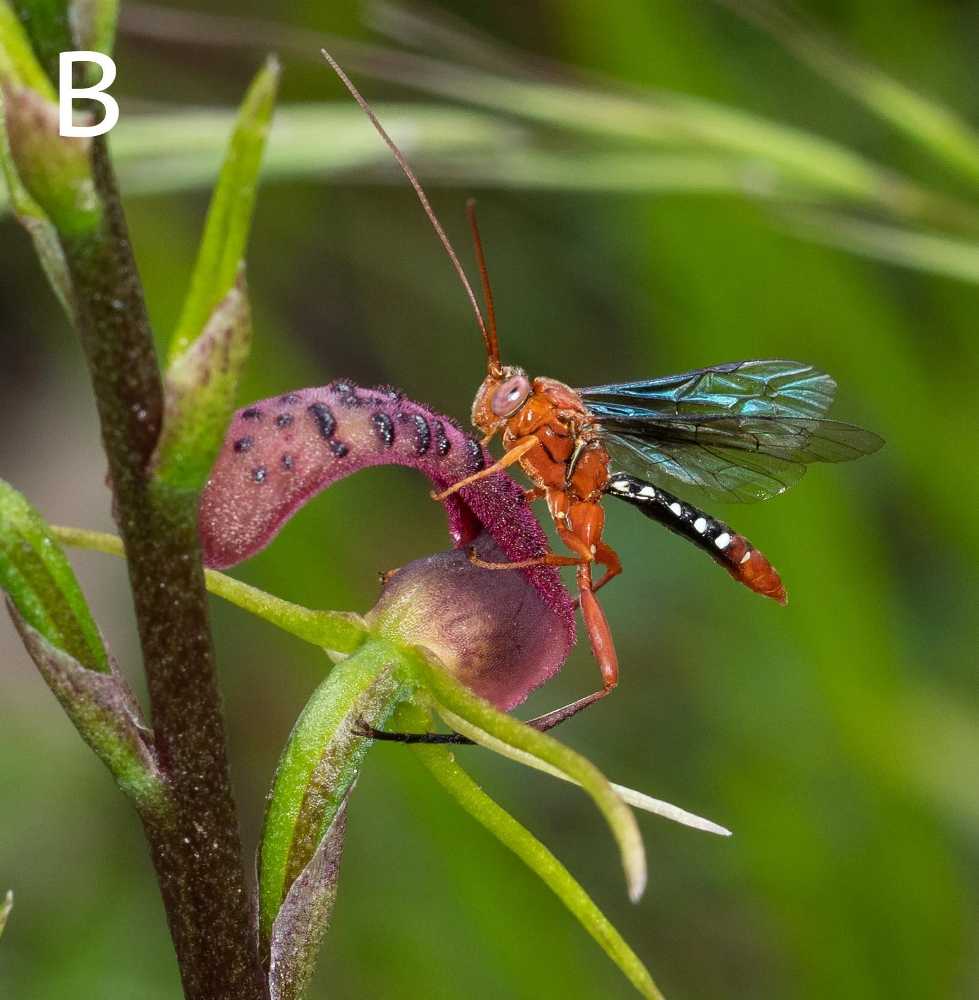
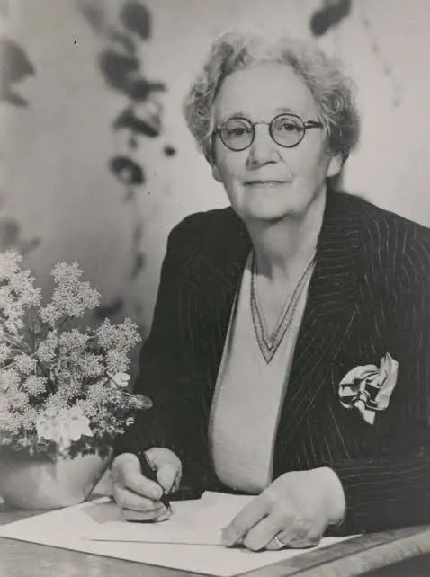

## Story 3 · Histoire 3 {background-color="#1B4332"}

### When a Flower Lies
*Quand une fleur ment*
{width="80%" fig-align="center"}

::: {.notes}
Transition, ~5 sec. Timing target for Story 3: ~9 minutes.
:::

## 1862 · Kent, England {.hook}

Charles Darwin studies orchids growing near his home — including the
fly orchid (*Ophrys insectifera*), which produces no nectar and is
almost never visited by insects.

<!-- TODO: add images here — a portrait of Darwin, and a photo of an
Ophrys/fly orchid flower. Drop files into images/ and use:
{width="50%" fig-align="center"} -->

> "Something seems to be out of joint in the machinery of [the Fly
> orchid's] life."
>
> — Charles Darwin, 1862

> **How could a flower with no reward still get pollinated?**
>
> *Comment une fleur sans récompense peut-elle quand même être pollinisée ?*

⏳ 45 seconds.

::: {.notes}
Darwin was genuinely disturbed by this — he suspected "an organized
system of deception" but never once witnessed a pollinator in action,
so he couldn't explain the mechanism. Same "great mind, stumped"
opening as Story 1 (Fabre) — keep the parallel implicit, don't
over-explain it.
:::

<!--
## 1927 · Australia {.hook}

An amateur naturalist, Edith Coleman, notices something strange about the
orchids in her garden.

- *Cryptostylis* orchids, in Australia, are pollinated by only one
  visitor: male ichneumonid wasps
- The males attempt to mate with the flower itself
- No reward is offered — the flower is simply mistaken for a mate

:::: {.columns}
::: {.column width="50%"}
{width="70%" fig-align="center"}
:::
::: {.column width="50%"}
{width="50%" fig-align="center"}
:::
::::

> **How could the wasp be fooled so completely?**
>
> *Comment le frelon a-t-il pu être trompé à ce point ?*

::: {.notes}
Let a few guesses land before revealing — "impersonate" is the key word
to plant in their minds.
:::
-->

## The mechanism, revealed — twice, independently

*Le mécanisme, révélé — deux fois, indépendamment*

- **1916, Algeria** — Correvon & Pouyanne describe male wasps
  attempting to mate with *Ophrys* flowers: pseudocopulation
- **1927, Australia** — Edith Coleman independently documents the same
  behavior on the opposite side of the planet, in a completely
  different orchid (*Cryptostylis*) and a different wasp
- No reward is offered — the flower is simply mistaken for a mate

<!-- TODO: add images here — an Ophrys/wasp pseudocopulation photo,
a Cryptostylis orchid, a portrait of Edith Coleman. The commented-out
block above still has the original file references
(images/Cryptostylis.png, images/EdithColeman.png) if you want to
reuse those images here. -->

**The same trick, evolved twice on opposite sides of the planet.**

::: {.notes}
~1-1.5 min. The point is convergent evolution: two unrelated
lineages, oceans apart, arrived at the identical strategy
independently — that's more surprising than either discovery alone.
:::

## Bertil Kullenberg, from 1948

- Spends over a decade studying Mediterranean *Ophrys* orchids
- Shows the flowers chemically mimic a female bee's own sex pheromone
- Males attempt to mate with the flower — and carry pollen away in the
  process

**This is chemical mimicry, not just visual disguise.**

::: {.notes}
Ophrys = the bee orchid genus. Distinguish from Story 1's Bombyx moth
pheromone — same concept, opposite direction (flower faking insect, not
insect faking insect).
:::

## GC-MS confirms it

- Modern chemical analysis compares orchid scent blends to the real
  insect pheromone
- In several species, the match is nearly compound-for-compound

**Deception, written in chemistry.**

::: {.notes}
Same analytical toolkit as Story 1 — start planting the seed that all
three stories share this technology. End of Story 3 (~9 min total).
:::
