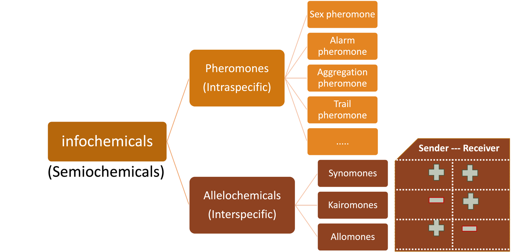
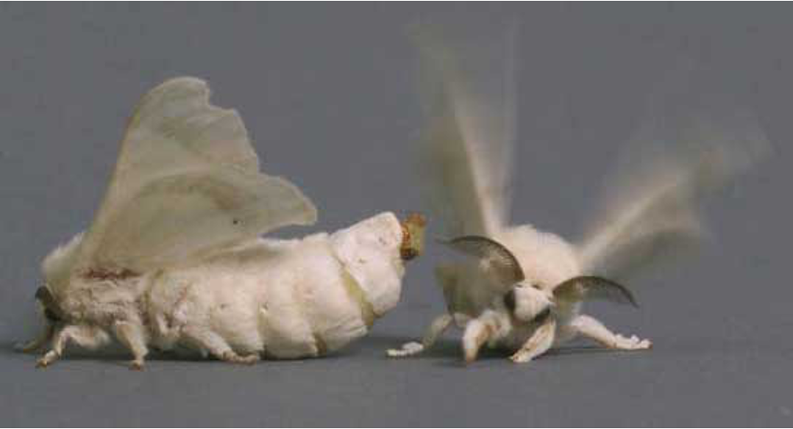
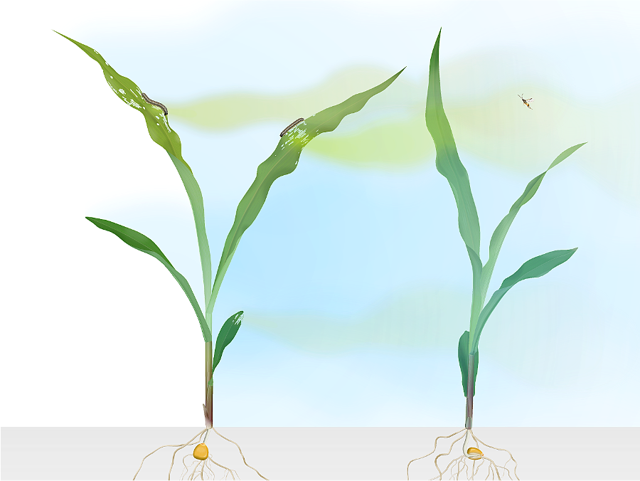
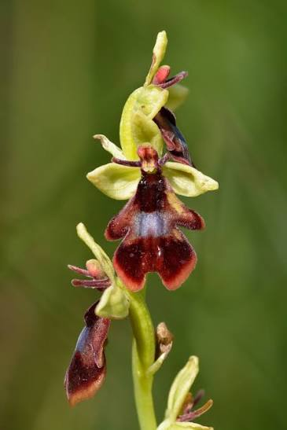
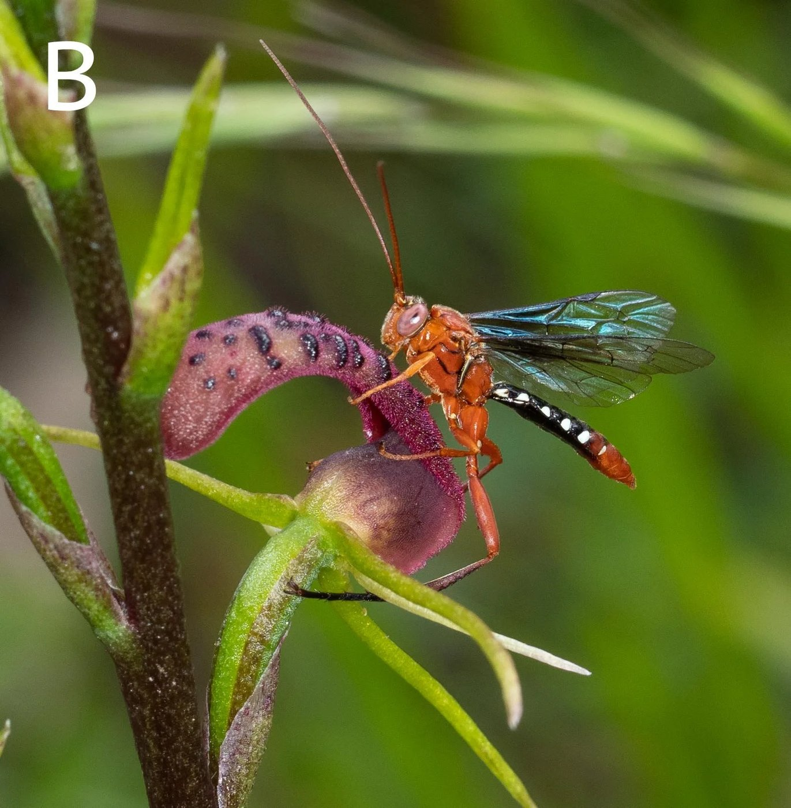
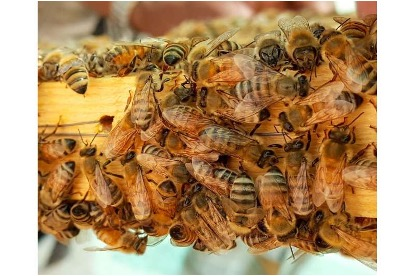
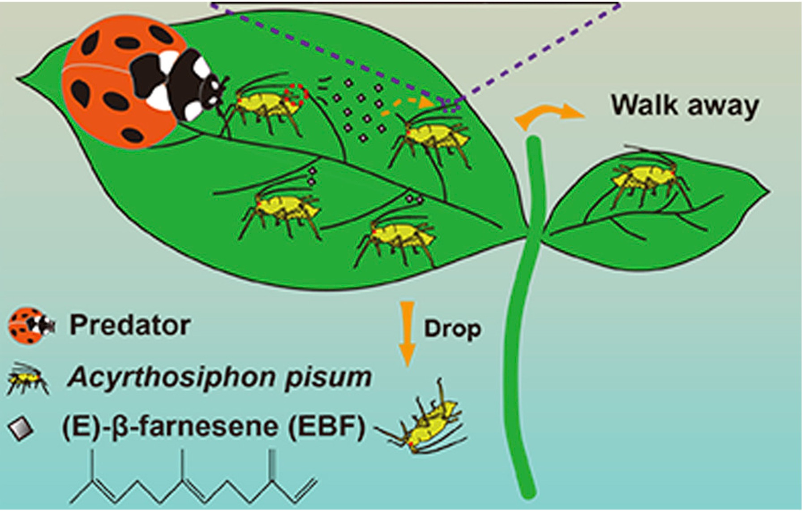
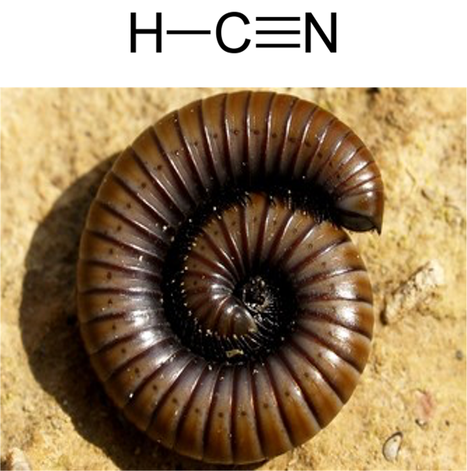

## Infochemicals {background-color="#1B4332"}

*Infochimiques*

::: {.notes}
Transition, ~5 sec.
:::

### Definition

> An **infochemical** (or semiochemical) is a chemical substance or mixture released by an organism that affects the behaviors of other individuals.

*Signaux (ou médiateur) chimiques émis par un organisme et modifiant le comportement et/ou la physiologie d'autres organismes
*

::: {.notes}
~1 min. This is the umbrella term over pheromones AND allelochemicals
— the split coming up next is about *who's talking to whom*, and *who
benefits*.
:::

## Infochemical categories

{width="40%" fig-align="center"}

- **Pheromone** — signal *within* the same species (intra-specific)
- **Allelochemical** — signal *between* different species (inter-specific)
  - further split by **who benefits**: the sender, the receiver, or both.

::: {.notes}
~30 sec. Set up the tree before filling in the leaves.
:::

## Examples: (1) Moths
{width="50%" .nostretch}

## (2) Turlings' maize (HIPV)

## (3) Deceptive orchid
:::: {.columns}
::: {.column width="50%"}
{width="60%" .nostretch}
:::
::: {.column width="50%"}
{width="87%" .nostretch}
:::
::::

## (4) Honeybee sting
Honeybees release Isoamyl acetate at a sting site to recruit other bees fight against invader 

## (5) Aphid dropping

Aphids can release (E)-β-farnesene when disturbed by natural enemies, inducing dropping behavior of other aphids
 
{width="50%" .nostretch}

## (6) Millipede defense
Some millipedes (Diplopoda: Polydesmida) secrete hydrogen cyanide for defense.

{width="30%" .nostretch}

## A few more examples
- **(7)**A queen bee's pheromone suppresses worker ovary development
- **(8)**Clove eugenol: Eugenol, the main compound in clove (*Syzygium aromaticum*) essential oil, deters insects from feeding on the plant that produces it.
- **(9)**Sagebrush releases volatiles after damage that "warn" — and prime the
  defenses of — neighboring sagebrush plants
- **(10)**Hundreds of bark beetles converge on a single tree after the first arrivals release a chemical drawing others to join them.

::: {.notes}
~1 min. Don't over-explain these — they're here so the quiz that
follows isn't limited to only the examples already discussed in
depth.
- A moth "listens in" on a bat's echolocation calls to evade capture

:::

<!--
## Quiz: classify it {.hook}

**In your group** — is this a sex, alarm, aggregation, or trail
pheromone; or an allomone, kairomone, or synomone?

> *"A parasitic wasp is attracted to a scent blend released by a plant
> under attack — and its arrival helps the plant get rid of the
> herbivore."*

⏳ 60 seconds, discuss in your group of 4.

::: {.notes}
Answer: synomone (both plant and wasp benefit) — this is literally the
Turlings system from Week 1. ~1.5 min with reveal.
:::

## Quiz: classify it (2) {.hook}

> *"A caterpillar-hunting beetle is drawn in by a volatile that a
> stressed, easier-to-attack plant releases — a cue the plant never
> "meant" to advertise."*

⏳ 60 seconds, discuss in your group of 4.

::: {.notes}
Answer: kairomone (only the beetle/receiver benefits, at the plant's
expense). ~1.5 min with reveal.
:::

## Quiz: classify it (3) {.hook}

> *"Hundreds of bark beetles converge on a single tree after the
> first arrivals release a chemical drawing others to join them."*

⏳ 60 seconds, discuss in your group of 4.

::: {.notes}
Answer: aggregation pheromone (same species, mass-attack strategy).
~1.5 min with reveal. End of Part 1.
:::

-->

## A few more examples:
{width="30%" .nostretch fig-align="center"}

## Some cool things to watch
- [Sexual deception of orchids](https://www.youtube.com/watch?v=hmI-rJuYAjw)

- [Blister beetle larvae hitchhiking on bees](https://www.youtube.com/watch?v=ZQ8h1YBTSvE)

- [Biocontrol on pest using Trichogramma (egg parasitoid)](https://www.youtube.com/watch?v=GdBKDTYR57o)
