## Sensory evolution {background-color="#1B4332"}

*Évolution sensorielle*

::: {.notes}
Transition, ~5 sec. Bridges directly from the smell test's unresolved
question.
:::

<!--
## Human vs. insect olfaction

- Humans: ~400 functional **olfactory receptor (OR)** genes,
  expressed in the nose
- Insects: a completely different OR gene family, expressed on the
  **antennae** — often far more sensitive and specific to individual
  compounds than human noses
- Recall Week 1: **GC-EAD** works precisely because an insect's own
  antenna can be wired up as an ultra-selective detector

::: {.notes}
~1.5 min. Direct callback to Story 1's "one living antenna."
:::

-->

## Example: asparagus and the smell of urine {.hook}

> **Some people notice a strong odor in their urine after eating
> asparagus — others notice nothing at all. Why?**
>
> *Certaines personnes remarquent une forte odeur dans leur urine
> après avoir mangé des asperges — d'autres ne remarquent rien. Pourquoi ?*

:::: {.columns}
::: {.column width="50%"}
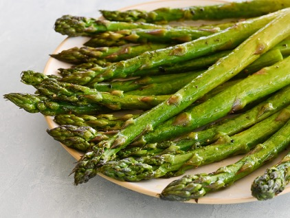{width="60%" .nostretch}

:::
::: {.column width="50%"}
{width="25%" .nostretch}

:::
::::

::: {.notes}
Let guesses land before the explanation. ~1.5 min.
:::

## Explanation
:::: {.columns}
::: {.column width="50%" .small-text}
  - Asparagus contains asparagusic acid (not smelly)
  - **Production**: it can be metabolized into sulfur-containing odorous (volatile) compounds
  - **Perception**: specific olfactory receptor (OR) variant is needed to smell them

> some people may not metabolize it into pungent odorous metabolites

> not everyone can smell them even when they're present

 
:::
::: {.column width="50%"}
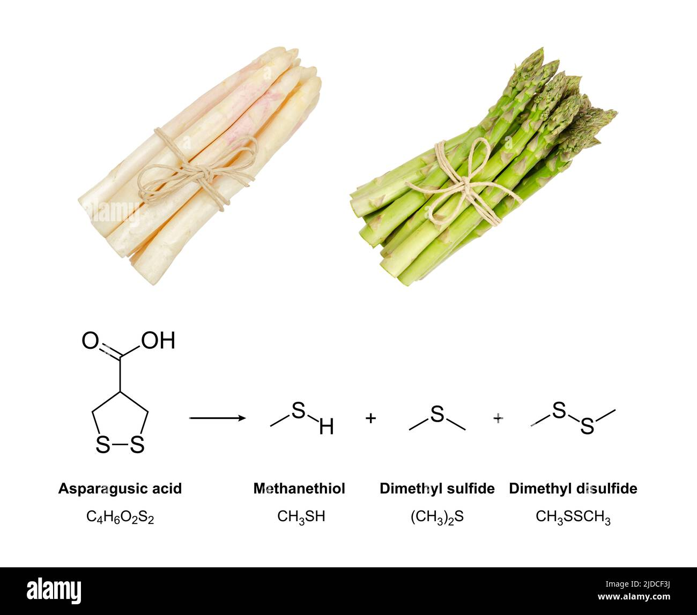{width="100%" .nostretch}

:::
::::

**Around 30-50% of people smell it**

::: {.notes}
~1.5 min. This is the mechanistic answer to the smell-test debrief:
specific anosmia is real, genetic, and well-documented (the classic
example is being unable to smell androstenone, or perceiving cilantro
as "soapy").
:::

## Olfactory receptors (OR) 
::: {.small-text}
**Asparagus anosmia**  
- Gene mutation region on chromosome 1 (1q44) 
- multiple genes in the olfactory receptor 2 (OR2) family. (*Markt et al. 2016*)

:::: {.columns}
::: {.column width="40%"}
- in [RED]{style="color:red;"}: loci containing one or more **intact genes**;  
- in [GREEN]{style="color:green;"}: loci containing only **pseudogenes**.  

> **~ 50% pseudogenes (non-functional)**

#### Why so many pseudogenes?

:::
::: {.column width="60%"}
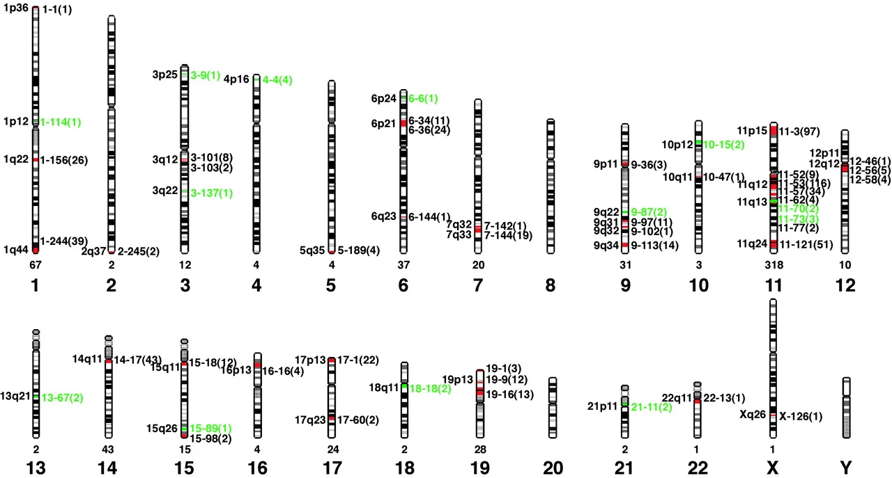{width="100%" .nostretch}
:::
::::

:::

## Human vision

:::: {.columns}
::: {.column width="70%"}

- We have excellent color vision 
  *Nous avons une excellente capacité à voir les couleurs*
    - thanks to trichromacy 
      *grâce au trichromatisme*
    - (three types of cones lining the retina) 
      *(trois types de cônes qui tapissent la rétine)*
- Trichromatic color vision is rare among mammals and exists only in certain primates. 
  *La vision trichromatique des couleurs est rare chez les mammifères et n'existe que chez certains primates.*

:::

::: {.column width="30%"}

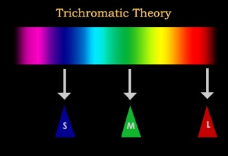

:::
::::

## 
:::: {.columns}
::: {.column width="40%"}
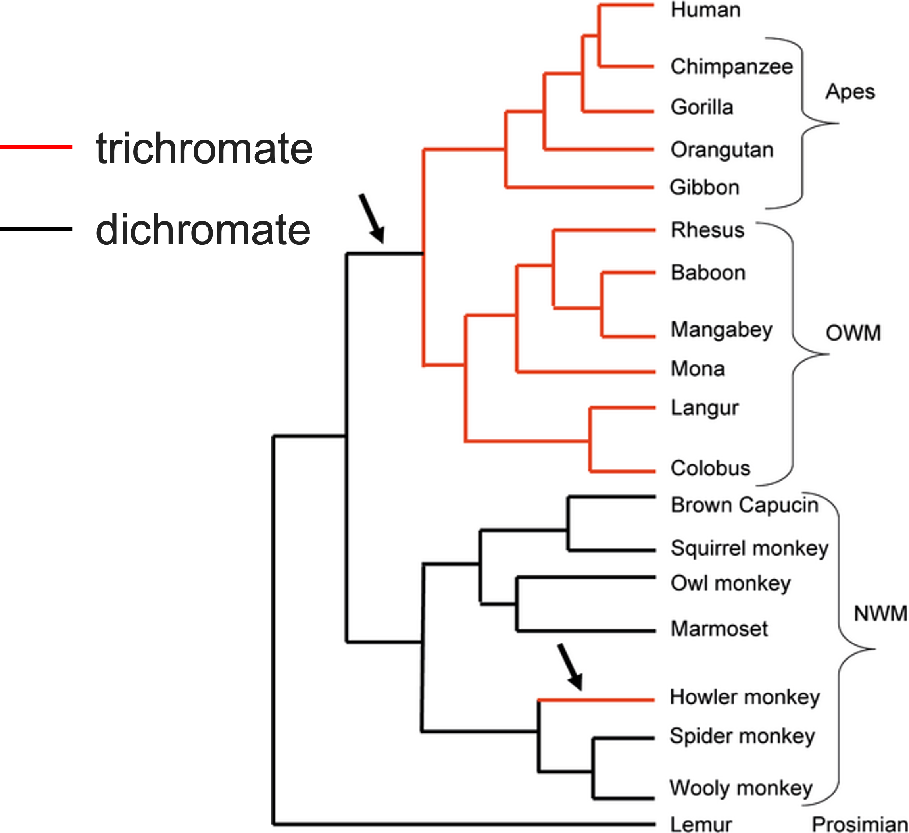{width="80%" .nostretch fig-align="center"}

:::

::: {.column width="40%"}
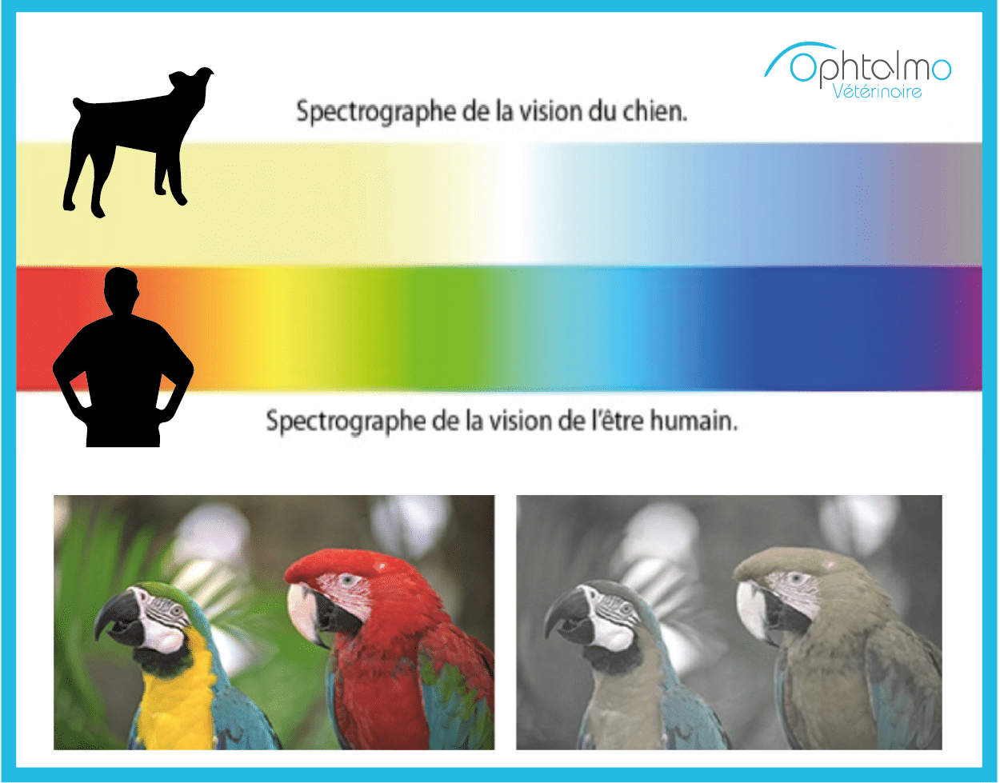{width="100%" .nostretch fig-align="center"}
:::
::::

> Our heavy reliance on vision may explain loss of olfactory gene function in humans.

*Notre forte dépendance sur la vision peut expliquer une perte de la fonction des gènes olfactifs chez l’homme.*

##
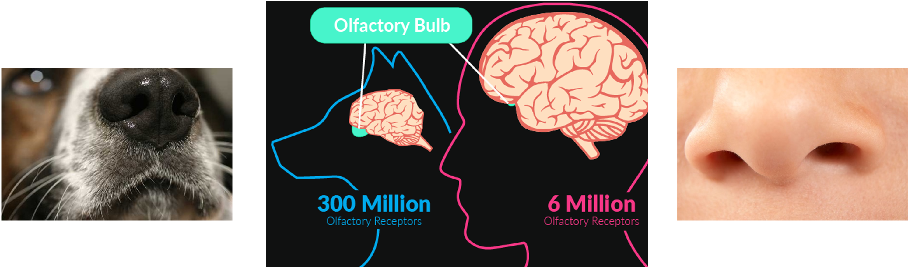{width="60%" .nostretch fig-align="center"}

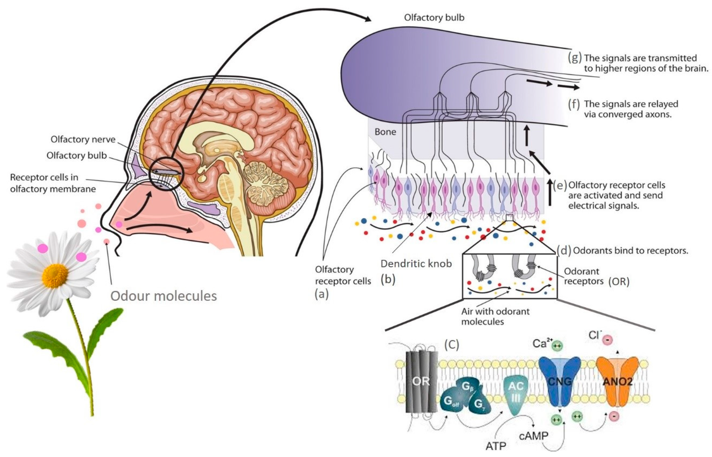{width="60%" .nostretch fig-align="center"}

## But we are also very sensitive to certain smells

*Mais nous aussi sommes très sensibles à certaines odeurs*

{width="50%" .nostretch fig-align="center"}

## Why so sensitive to sulfur compounds?

:::: {.columns}
::: {.column width="70%"}
- Rotting/spoiled protein releases volatile sulfur compounds 
  *La décomposition des protéines libère des composés sulfurés volatils*
    - bacteria break down sulfur-containing amino acids (cysteine, methionine) 
      *les bactéries dégradent des acides aminés soufrés (cystéine, méthionine)*

:::
::: {.column width="30%"}
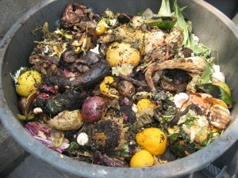{width="100%" .nostretch}
:::
::::

- Detecting them at trace levels gives an early warning against food poisoning 
  *Les détecter à l'état de trace donne une alerte précoce contre les intoxications alimentaires*

## Repurposed application of sulfur compounds

*Application détournée des composés soufrés*

:::: {.columns}
::: {.column width="50%"}
- **Repurposed**: This pre-existing sensitivity later repurposed for an unrelated danger: natural gas leaks 

  **Détournée**: *Une sensibilité préexistante plus tard détournée pour un tout autre danger : les fuites de gaz naturel*

:::
::: {.column width="50%"}
{width="100%" .nostretch}
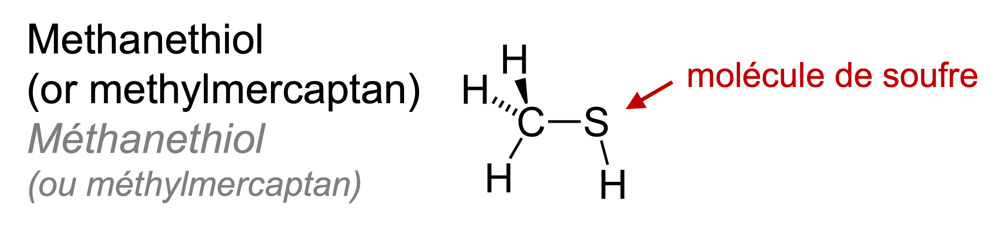{width="100%" .nostretch}

:::
::::

::: {.notes}
~1.5 min. Mechanism: sulfur's larger atomic radius/polarizability lets
it bind certain olfactory receptor pockets with very high affinity,
hence the extremely low detection threshold. Adaptive story: this
evolved to protect against eating spoiled/decayed protein, NOT for gas
safety - that's a much later human repurposing of a pre-existing
sensitivity. Sets up the canary/mercaptan slide next.
:::

## The canary bird in the coal mine {.hook}
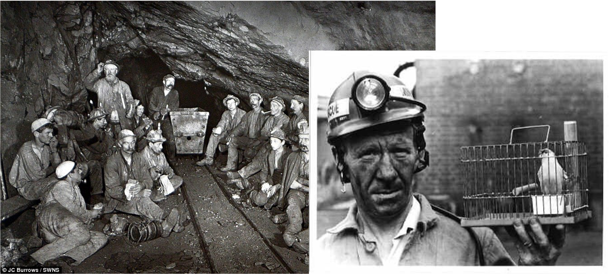{width="80%" .nostretch fig-align="center"}

::: {.small-text}
Coal miners once carried caged canaries underground. Canaries are far
more sensitive to carbon monoxide than humans — if the canary showed
distress or died, miners knew to get out **before** the gas reached a
dangerous concentration for them.
:::

::: {.notes}
~1.5 min. Two ideas in one slide: (1) species differ enormously in
detection sensitivity to the same threat, (2) even human olfaction,
generally unremarkable compared to other animals, can be exquisitely
sensitive to specific compounds when it matters. Sets up the
"detection threshold" idea for the information theory section.

Important nuance: CO is odorless - to canaries as much as to humans.
The canary isn't smelling CO better, it's succumbing to CO poisoning
faster, thanks to the avian respiratory system's continuous,
cross-current airflow (air sacs keep air moving through the lungs on
both inhale AND exhale, unlike mammalian tidal breathing) plus a much
higher metabolic/breathing rate - so canaries absorb toxic gas (and
build up carboxyhemoglobin) much faster than a human breathing the
same air. This is a physiological-vulnerability story, not a
detection story like the rest of this section - worth saying
explicitly so students don't assume "canary = super-smeller."

Source on the French odorant history: https://www.slate.fr/story/67469/gaz-odeur-pourquoi
:::

## Synthesis · Synthèse {background-color="#1B4332"}

- Chemical communication is ancient, universal, and often the primary
  channel of communication in the animal kingdom. 
  *La communication chimique est ancienne, universelle, et souvent le
  principal canal de communication dans le règne animal.*
- "Infochemical" is the umbrella; the categories are all about **who
  sends, who receives, and who benefits** 
  *« Infochimique » est le terme générique ; les catégories portent
  toutes sur qui envoie, qui reçoit, et qui en bénéficie*
- Certain species have evolved highly developed senses — but always
  with trade-offs 
  *Certaines espèces ont développé des sens très perfectionnés — mais
  toujours avec des compromis*    

## Thank you {background-color="#1B4332"}
*Merci* 

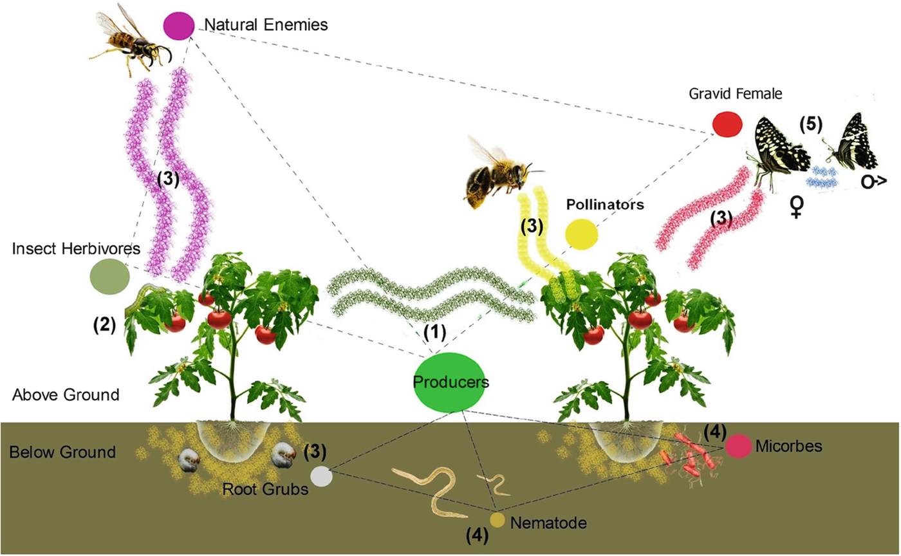{width="80%" .nostretch}

::: {.notes}
~1-1.5 min. Close warmly, bridge to Week 3. End of session.
:::
