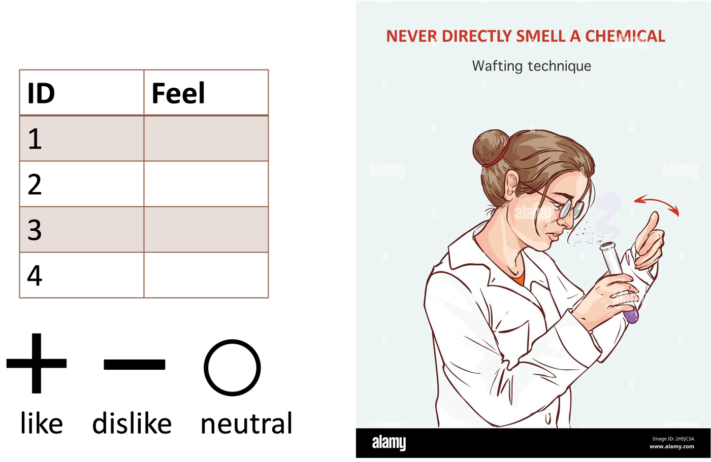
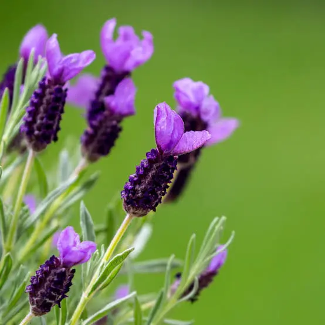
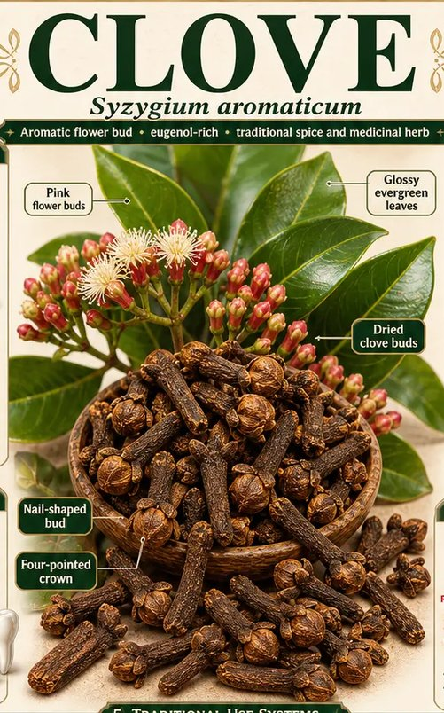
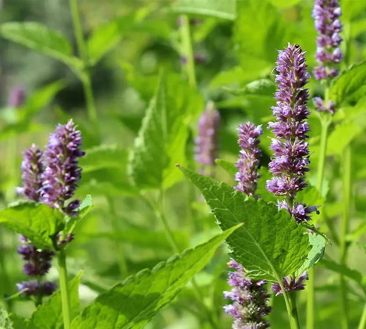
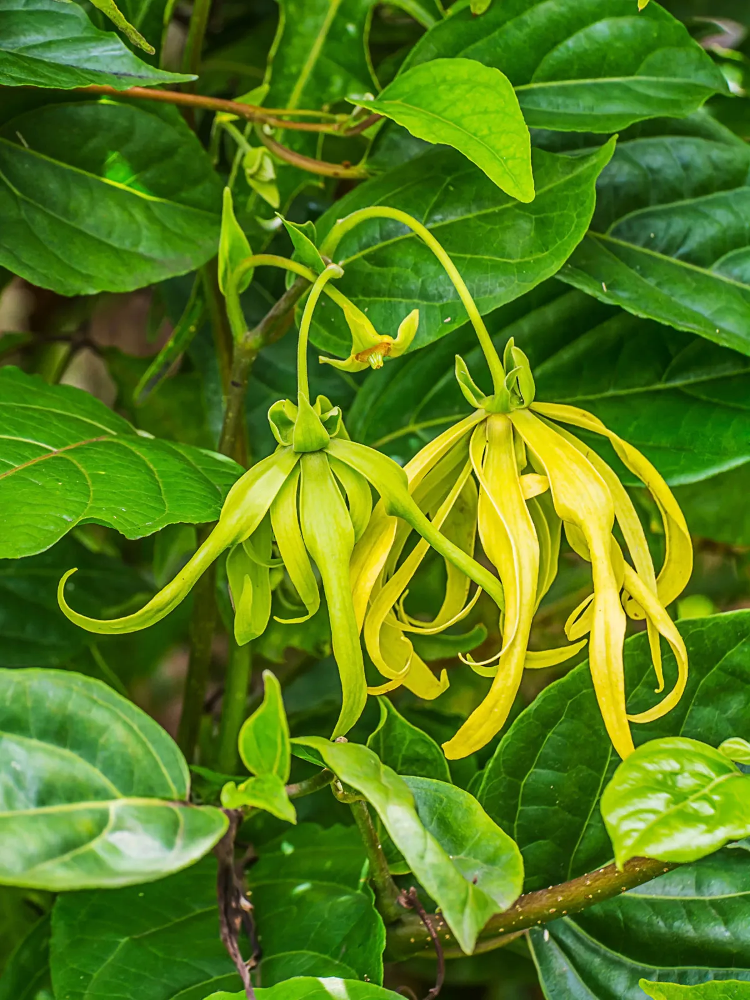

## [Smell Test]{.title-badge}
*Test olfactif*

:::: {.columns}
::: {.column width="50%"}
{width="100%" .nostretch fig-align="center"}
:::
::: {.column width="50%"}
- Each person in your group of 4 smells all 4 strips **on their own**
and privately notes: like / dislike / neutral for each.
- Share your ratings with your group. Did you all react the same
way to each strip?
- Fill your ratings to Moodle --> Smell test
:::
::::

<!--
::: {.notes}
For each strip: *raise your hand if your group had a genuine
disagreement (at least one like AND at least one dislike)
:::

## Activity: 4 strips, 15 groups

TODO: prep 15 sets of 4 labeled strips (or diffuser stations) -
one clove, one lavender, one patchouli, one ylang-ylang per group of
4 students. Don't reveal which oil is which until the debrief.

- **Clove** — a real chemical deterrent (eugenol is a documented
  natural insect repellent)
- **Lavender** — broadly liked across cultures; a "consensus pleasant"
  control
- **Patchouli** & **Ylang-ylang** — both classic "love it or hate it"
  scents, for different reasons (earthy/musty vs. intensely sweet)

::: {.notes}
~1 min setup/instructions. Keep labels hidden - "strip A/B/C/D" -
until after the vote, so reactions aren't biased by expectation.
:::

## Step 1 — smell & rate, individually

Each person in your group of 4 smells all 4 strips **on their own**
and privately notes: 👍 like / 👎 dislike / 😐 neutral for each.

⏳ 4 minutes.

::: {.notes}
Individual first, before any discussion — this is the step that
generates real variance to talk about later. Walk the room with
strips/stations if using a shared set per group.
:::

## Step 2 — compare within your group

Share your ratings with your group of 4. Did you all react the same
way to each strip?

⏳ 3 minutes.

::: {.notes}
~3 min. Groups of 4 should already start noticing disagreement here,
especially on patchouli/ylang-ylang.
:::

## Step 3 — whole-class show of hands

For each strip: *raise your hand if your group had a genuine
disagreement (at least one like AND at least one dislike).*

::: {.notes}
~3 min across all 4 strips. With 15 groups this is fast and visual -
expect clove and lavender to show mostly consensus, patchouli/
ylang-ylang to show many raised hands.
:::
-->

## Discussion {.hook}

- Any ideas what they are? (clove, lavender, etc.?) 
  *Une idée de ce que c'était ? (clou de girofle, lavande, etc. ?)*
- **Why might the exact same chemical signal be perceived
  differently by different people?** 
  *Pourquoi un même signal chimique peut-il être perçu si
  différemment selon les personnes ?*
- Will insects be attracted or deterred by the smell? 
  *Est-ce que les insectes seraient attirés ou repoussés par cette odeur ?*

::: {.notes}
Let intuitions surface: genetics (some people are "blind" to specific
compounds — specific anosmia), prior experience/memory, cultural
association, concentration/context. Don't resolve fully here - the
next section (olfactory receptors) gives the mechanism. ~4 min.
:::

## Reveal: what were strips 1–4?

*Révélation : quelles étaient les 4 odeurs ?*

::: {.compact-table}
| # | Oil | Scientific name | Tissue used | Main compound(s) | Use |
|---|---|---|---|---|---|
| 1 | Lavender | *Lavandula angustifolia* | Flowers | Linalool, linalyl acetate | Aromatherapy, cosmetics, mild antiseptic |
| 2 | Clove | *Syzygium aromaticum* | Flower buds | Eugenol | Insect repellent, dental analgesic, spice |
| 3 | Patchouli | *Pogostemon cablin* | Leaves (dried, fermented) | Patchoulol | Perfume fixative/base note, insect repellent |
| 4 | Ylang-ylang | *Cananga odorata* | Flowers | Linalool, germacrene D, benzyl acetate | Perfumery, aromatherapy, traditional hair care |
:::

:::: {.columns}
::: {.column width="25%"}
{width="85%" .nostretch}

:::
::: {.column width="25%"}
{width="55%" .nostretch}
:::

::: {.column width="25%"}
{width="100%" .nostretch}

:::
::: {.column width="25%"}
{width="65%" .nostretch}

:::
::::

::: {.notes}
~1 min. Now that reactions are already on the table, reveal identity
and a bit of real chemistry/botany - satisfying "answer key" moment.
Note clove's eugenol is the same compound behind its documented
insect-repellent activity - a nice bridge back to the allomone
concept from Part 1. Total activity: ~16 min.
:::
