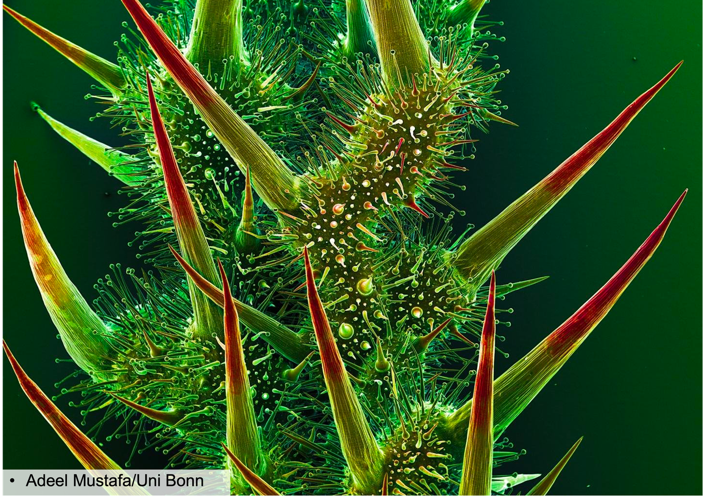
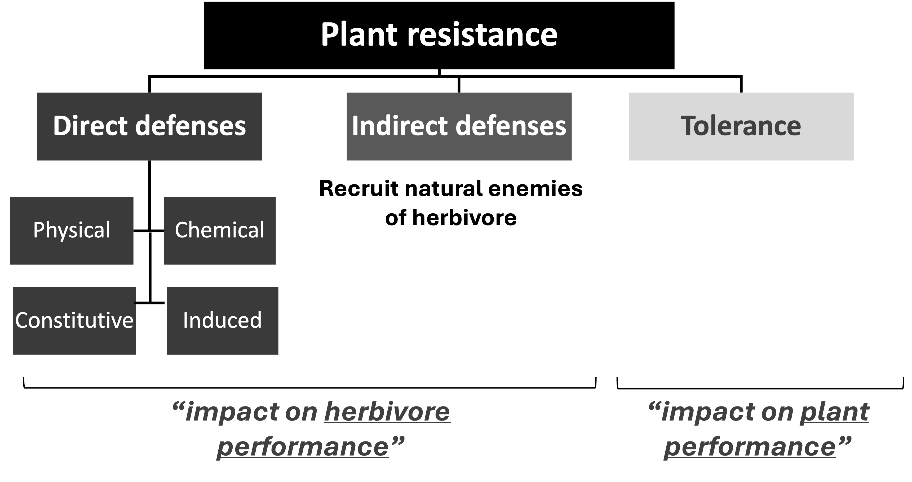
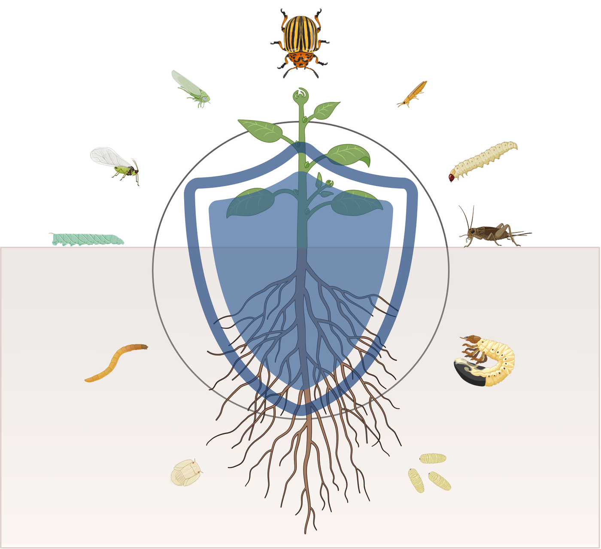

## Plant Resistance {background-color="#1B4332"}

*Résistance des plantes*

{width="80%" fig-align="center"}

## 
{width="80%" fig-align="center"}

## Direct Resistance 

*Résistance directe*

{width="80%" fig-align="center"}

##

- Physical resistance
  - Cuticle, wax, lignification
  - Trichomes, spines, thorns
  - Secretory defenses (resin, gum, latex)
  - Calcium oxalate crystals

- Chemical resistance
  - Toxins (Glucosinolates, Nicotine, BXDs)
  - Reduced digestibility (Protease inhibitors)

::: {.notes}
Transition, ~5 sec.
:::

## Two independent axes

Direct resistance varies along two separate dimensions:

| | **Physical** | **Chemical** |
|---|---|---|
| **Constitutive** (always present) | thorns, trichomes, tough cuticle | baseline toxins, always "loaded" |
| **Induced** (made/boosted after attack) | extra trichomes after damage | toxin production ramps up on attack |

::: {.notes}
~1.5 min. Set up this 2x2 up front - the rest of the section just
fills in examples for each cell. Physical vs. chemical is about *how*
the plant defends; constitutive vs. induced is about *when*.
:::

## Physical resistance

- **Trichomes** (leaf/stem hairs) — physically impede small
  insects, some are hooked or glandular (sticky, or chemical-tipped)
- **Thorns and spines** — deter large vertebrate browsers
- **Tough cuticle, high silica content** — wear down insect
  mandibles (grasses are notoriously silica-rich for this reason)
- **Latex and resin canals** — flood a wound with sticky, often
  toxin-laden fluid the instant tissue is cut

::: {.notes}
~1.5 min. Latex/resin canals are a nice bridge slide - physically
disabling AND chemically loaded at once, foreshadowing that the
physical/chemical split is often blurry in practice.
:::

## Chemical resistance: Toxins

- **Cyanogenic glycosides** in cassava, almond, sorghum — release
  cyanide when tissue is crushed (by a chewing herbivore)
- **Glucosinolates** in *Brassica* (broccoli, Brussels sprouts,
  mustard) deter many insect herbivores 
    — the same bitter compounds behind human taste variation
  (TAS2R38 gene: bitter taste receptor). You may blame this if you don't like *Brassica* vegetables 
- **Nicotine** in tobacco — a baseline, constantly-present
  neurotoxin
- **Benzoxazinoids (BXDs)** in grasses. A class of indole-derived plant chemical defenses. Widespread in grasses, including important cereal crops such as maize, wheat and rye
  - a wide range of antifeedant, insecticidal, antimicrobial, and allelopathic activities. 

::: {.notes}
~1.5 min. Direct callback to the Brussels sprouts/broccoli TAS2R38
conversation from Week 2 - same compounds, now viewed from the plant
defense side instead of the human taste side.
:::

## Chemical resistance: reduce digestibility 

- **Proteinase inhibitors** (PIs) and *Threonine Deaminase* (TD)

  - Plant-derived compounds that bind to proteases in the insect gut
  - Insect gut proteases shuttle molecules into metabolic pathways
  - Inhibiting these proteases starves the insect of nutrients    

> tomato and potato leaves ramp up
  production within hours of wounding, blocking a caterpillar's
  ability to digest protein at all

::: {.notes}
~2 min. Explicit callback to Week 1 Story 2 (Fraenkel/Turlings) -
students already know this example, now it's being reframed as one
specific case (induced + volatile + indirect) inside the bigger
resistance framework. Flag clearly that HIPV attraction of enemies is
INDIRECT resistance (next week's topic) even though it's induced -
induced/constitutive and direct/indirect are different axes too.
:::

## Why not just maximize constitutive defense all the time?

<!-- 
- Producing and storing defenses **costs resources** — energy and
  nutrients not spent on growth or reproduction
- **Constitutive** defense: always ready, but always paying the cost
  — good when attack is frequent/predictable
- **Induced** defense: cheaper when unattacked, but there's a delay
  before it ramps up — good when attack is rare/unpredictable
- Most plants run **both** at once, tuned to their own risk
-->

::: {.notes}
~1.5 min. This is "optimal defense theory" in miniature, without
needing the term. Ties the whole 2x2 back to a single economic logic
- a nice synthesis moment before moving to tolerance.
:::
