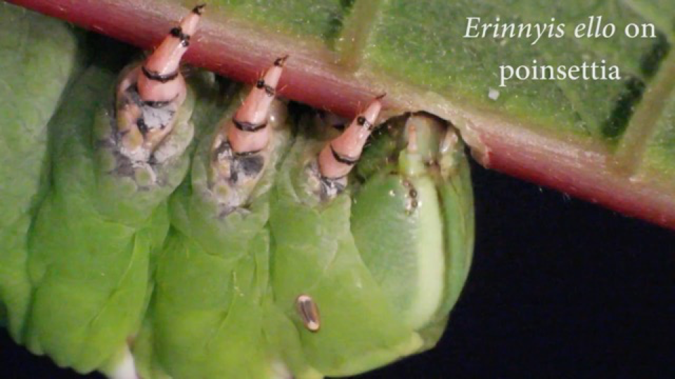
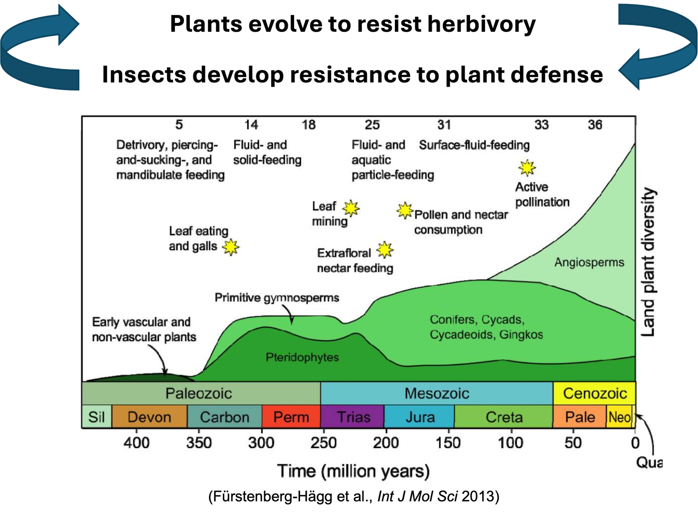
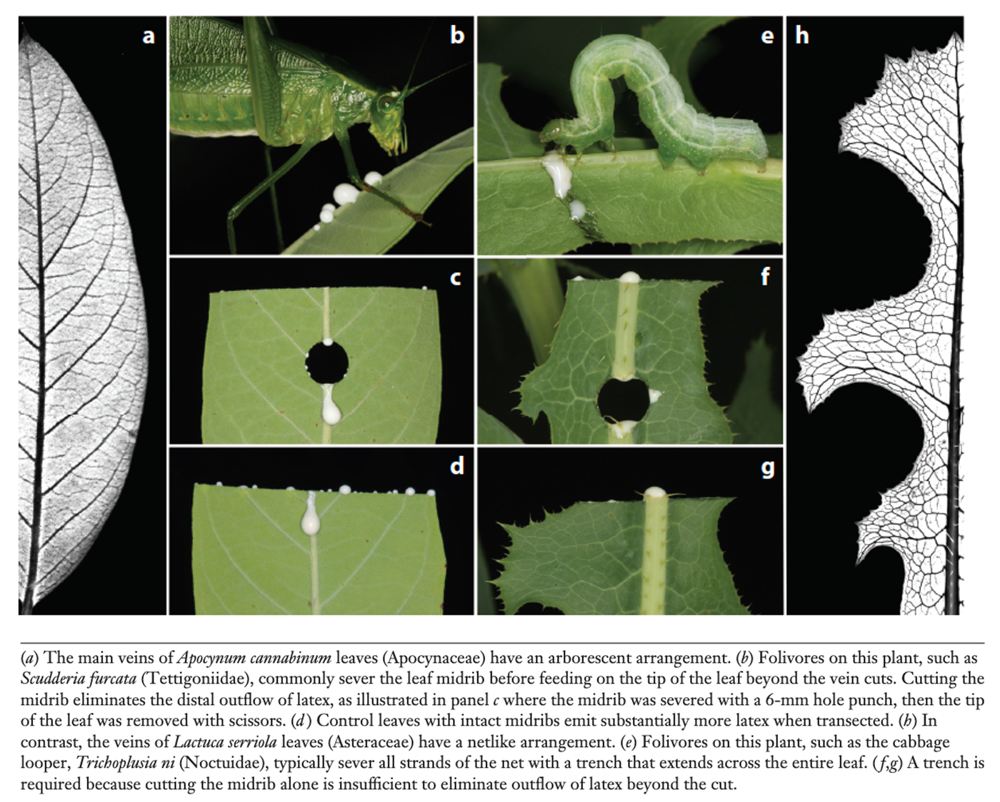
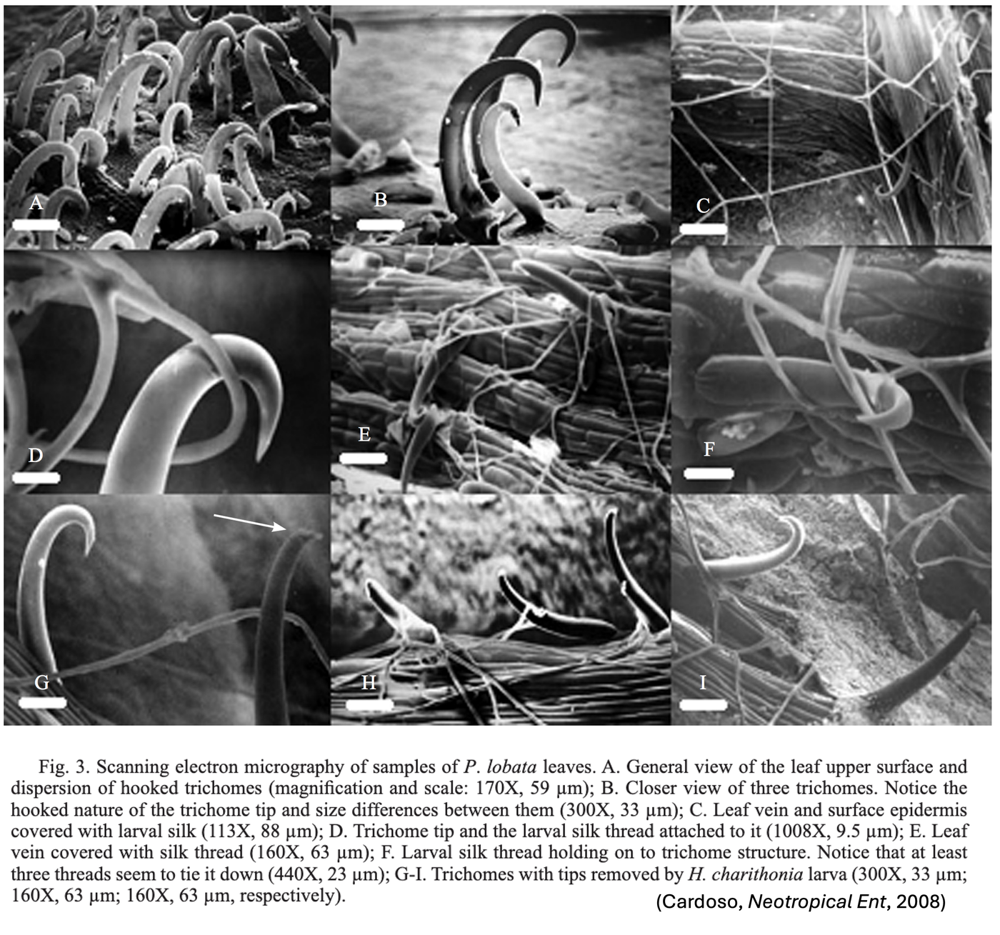
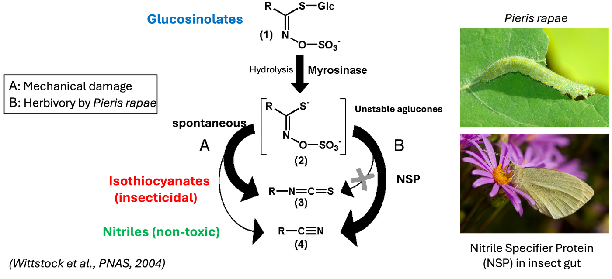
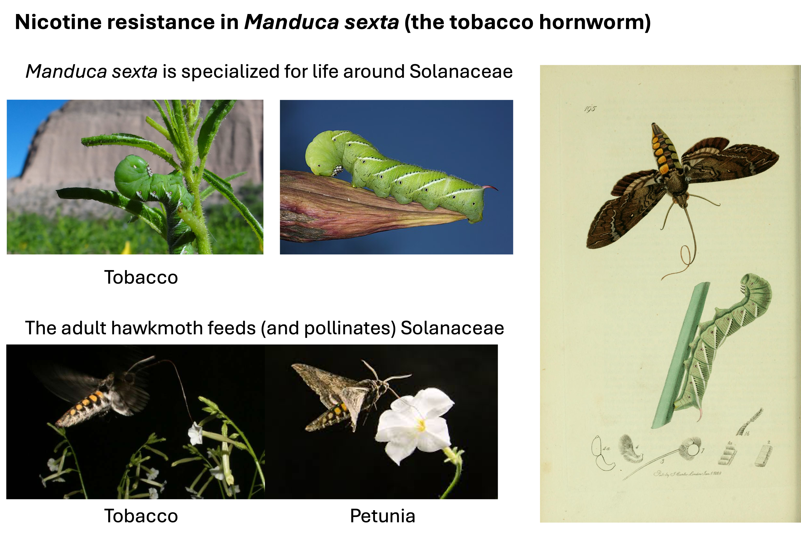
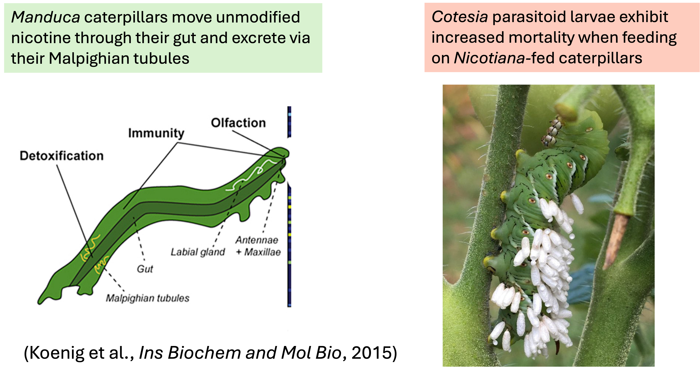
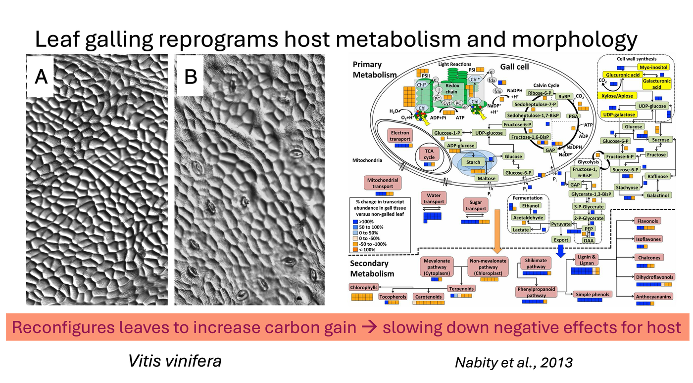

## Insect Countermeasures {background-color="#1B4332"}

*Contre-mesures des insectes*

{width="80%" .nostretch fig-align="center"}

::: {.notes}
Transition, ~5 sec. Every plant defense in the last section has a
matching herbivore counter-adaptation - this is the other side of the
arms race, and it closes the loop back to the phylloxera story: an
adapted enemy vs. a naive host is exactly what these countermeasures
are for.
:::

## Evolutionary arms race
{width="70%" .nostretch fig-align="center"}

## Insect Countermeasures to plant direct resistance
- Specialized behavior
- Detoxification
- Sequestration of toxic compounds
- Hijacking host metabolism

## Specialized behavior 
Vein-cutting / trenching

{width="60%" .nostretch fig-align="center"}

## Specialized behavior
> Wandering larvae lay silk mats on the trichomes and remove their tips by biting

{width="100%" fig-align="center"}

::: {.notes}
~1.5 min. Vein-cutting is a great visual/memorable example - it's
literally a behavioral countermeasure engineered around one specific
plant defense structure (latex canals).
:::

## Detoxification
> Some *Brassica* specialists breakdown glucosinolates toward a non-toxic product instead of
  the toxic one the plant "intends"

{width="70%" fig-align="center"}

::: {.notes}
~1.5 min. The glucosinolate example ties back to the
Brussels-sprouts/TAS2R38 story again - now from the insect's
counter-adaptation side.
:::

## Sequestration

{width="70%" fig-align="center"}

## Sequestration
> Some herbivores **store it
  unmodified** in their own tissues

{width="50%" fig-align="center"}

> The plant's allomone (defends the plant, generally harms herbivore)
  becomes the **herbivore's own allomone** against its predators —
  the exact same molecule, doing the same job, one trophic level up

::: {.notes}
~1.5 min. Direct callback to Week 2's infochemical classification -
this is a clean example of a molecule's "who benefits" classification
flipping depending on which relationship you're looking at.
:::

## Hijacking host metabolism
{width="70%" fig-align="center"}

<!--
- **Gall-forming insects** manipulate the plant's own growth hormones
  (cytokinins, auxins) to build a nutrient-rich, protective structure
  — the plant's own developmental machinery, redirected for the
  insect's benefit

-->

::: {.notes}
~1.5 min. This is the most sophisticated countermeasure category -
not avoiding or neutralizing the defense, but disabling the plant's
own signaling before it fully activates.
:::

## The arms race continues

Plant defense <---> herbivore counter-adaptation

**Coevolution takes time. In the case of phylloxera and European
grapevines, a novel enemy is introduced but the coevolution history isn't there yet. **

::: {.notes}
~1.5 min close. Full-circle callback to the opening story. Sets up
next week's indirect resistance as yet another layer in the same
ongoing arms race.
:::
