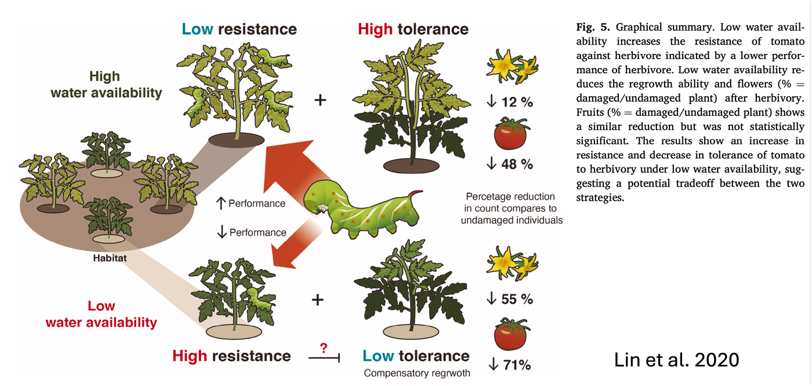

## Tolerance {background-color="#1B4332"}

*Tolérance*

::: {.notes}
Transition, ~5 sec. Keep this section brief (~4 min total) - it's a
deliberate contrast point, not a full topic like direct resistance.
:::

## A completely different strategy

- **Resistance** = reduce how much damage happens
- **Tolerance** = accept the damage, minimize its cost to fitness
- A tolerant plant can be eaten just as much as a non-tolerant one —
  it just suffers less for it

**Mechanisms**: compensatory regrowth, extra branching/tillering
after apical damage, reallocating stored reserves (roots,
rhizomes), boosted photosynthesis in surviving tissue

::: {.notes}
~2 min. Classic example: grasses grow from the base, not the tip, so
grazing removes leaf tissue without killing the growth point at all -
this is exactly why lawns and pastures can be grazed/mowed repeatedly
without dying. Note grasses ALSO use physical resistance (silica) -
the two strategies aren't mutually exclusive.
:::

## Why not just tolerate everything?

- Regrowth still costs resources, redirected from growth or seed
  production
- Tolerance does nothing to stop a herbivore that could transmit
  disease, or one attack severe enough to kill the plant outright
- Across species, heavy investment in resistance and heavy
  investment in tolerance tend to trade off — few plants do both to
  the maximum

## Resistance vs. Tolerance
{width="80%" fig-align="center"}

::: {.notes}
~2 min. Bridge cleanly into next week without covering indirect
resistance's actual mechanics today - just name it and place it in
the framework (direct resistance vs. tolerance vs. indirect
resistance = three fundamentally different answers to "what do you do
about a herbivore").
:::
