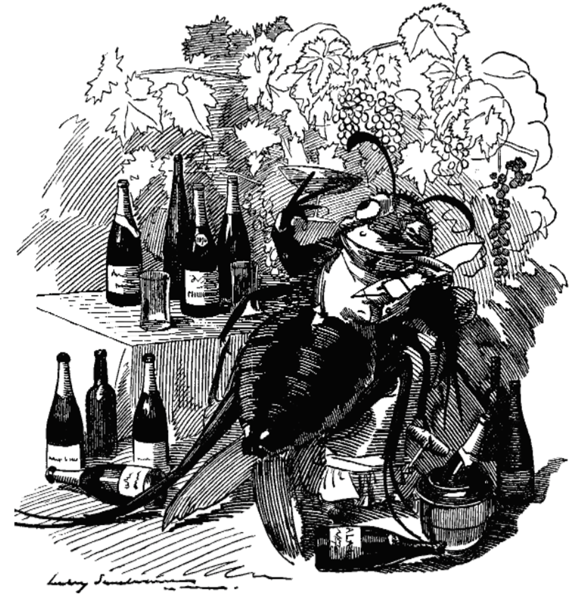
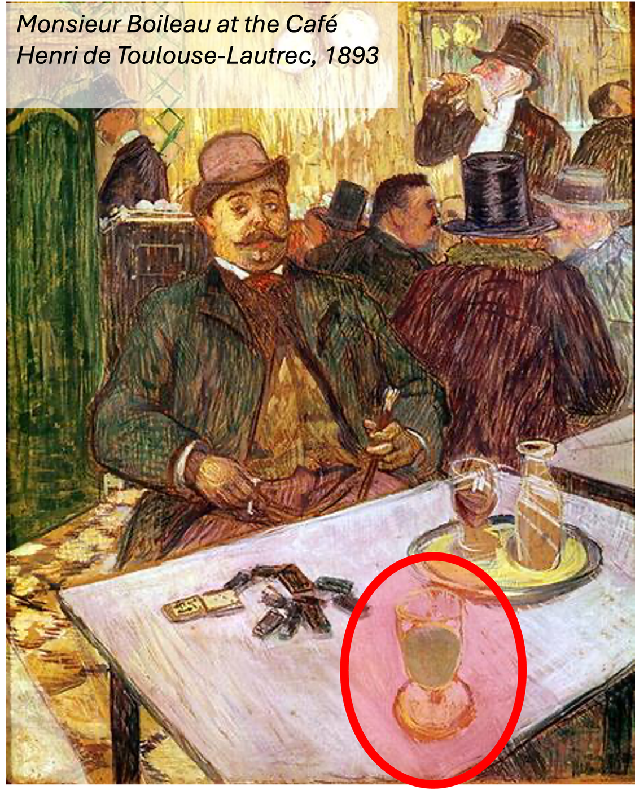
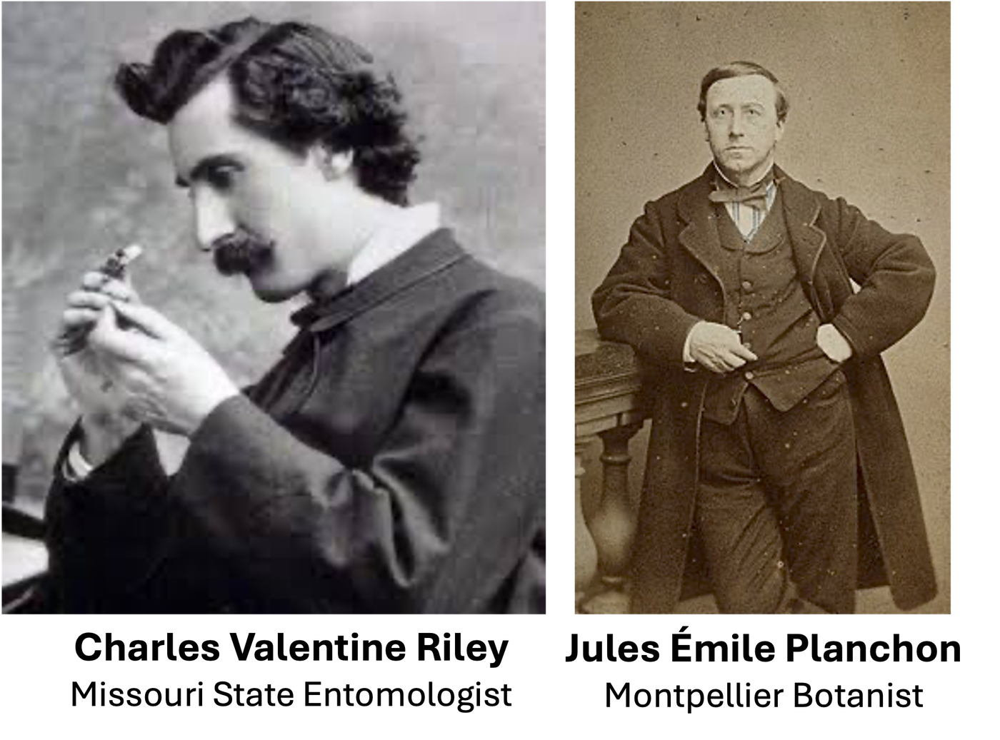
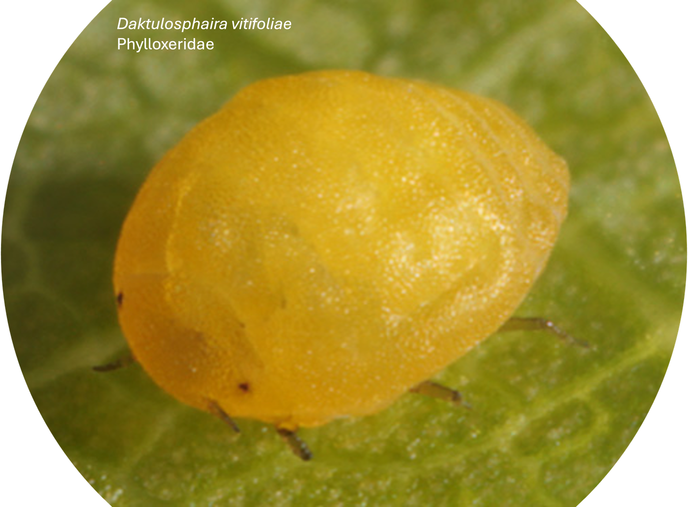
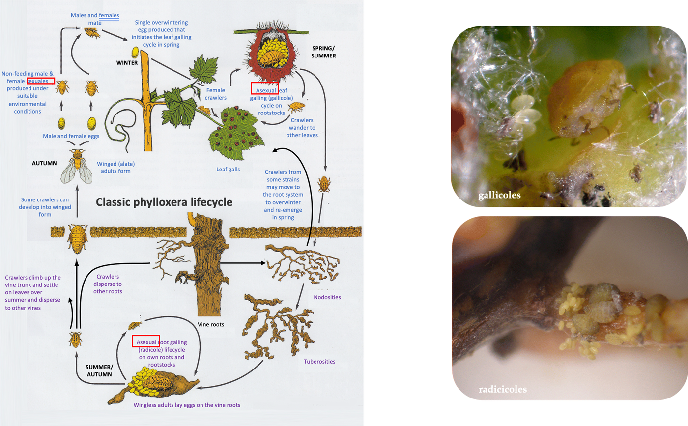
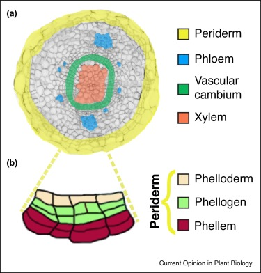
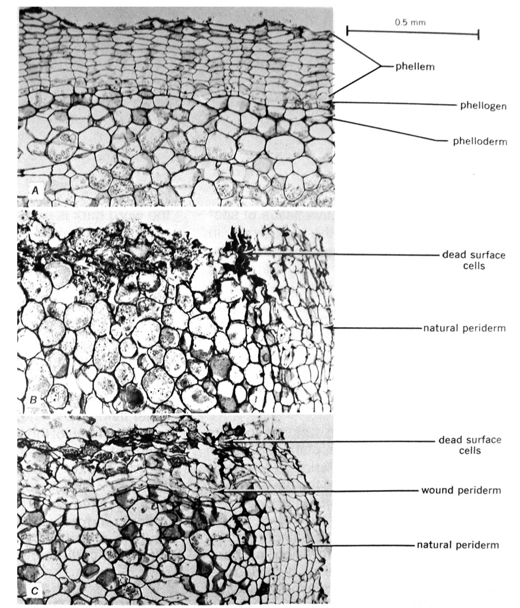
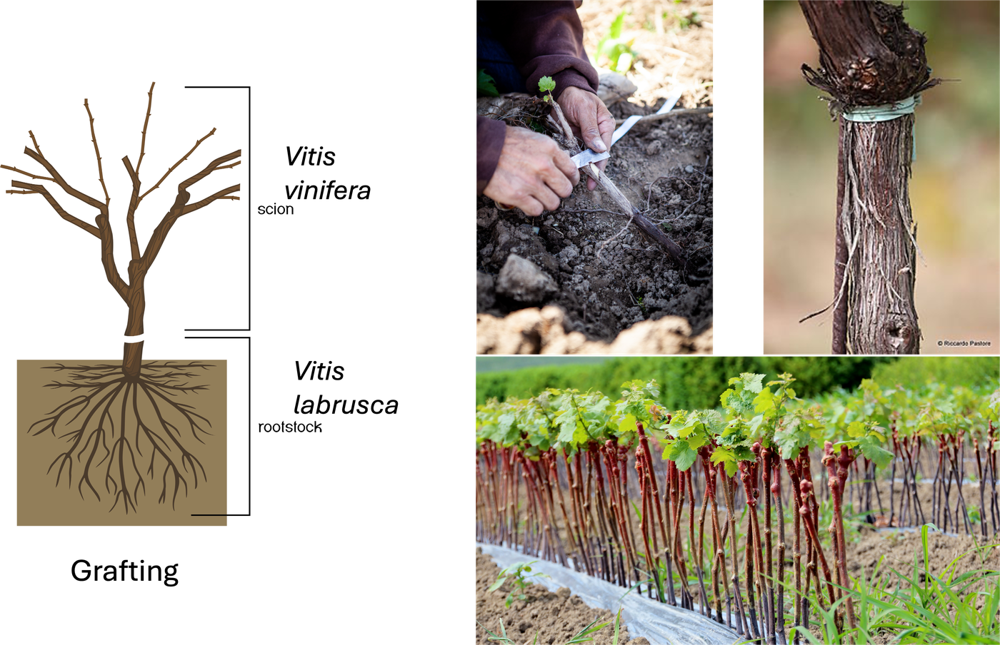

## The Great French Wine Blight {background-color="#1B4332"}
 *la grande crise du phylloxéra*

{width="40%"}

## Pairs, 1800s
:::: {.columns}
::: {.column width="50%"}
{width="80%" fig-align="center"}

:::

::: {.column width="50%"}
> A bright-green, wormwood-and-anise spirit becomes the
> drink of a generation — nicknamed the "Green Fairy." 
>
> *Un spiritueux vert vif, à base d'absinthe et d'anis, devient la
> boisson d'une génération — surnommée la « fée verte ».*

- What is it? Why it gets so popular in late 1800s?

:::
::::

::: {.notes}
Let a few guesses land (cheaper? fashionable? artists?) before the
reveal. All true, but there's a deeper, entirely botanical cause
underneath the fashion story. ~2 min including the reveal below.
:::

## 
:::: {.columns}
::: {.column width="50%"}
{width="70%" .nostretch fig-align="center"}

:::

::: {.column width="50%"}
The vines were dying

- In the 1860s, French vineyards began mysteriously wilting and
  dying, vineyard by vineyard, with unknown cause

- Wine became scarce and expensive — people needed a
  substitute, and **absinthe** (grain- and herb-based)
  was cheap, strong, and unaffected by the shortage

> Why vines were dying?

:::
::::

::: {.notes}
~1.5 min. This is "Le Grand Phylloxéra" - one of the most destructive
plant epidemics in agricultural history.
:::

## The culprit: *Phylloxera*

:::: {.columns}
::: {.column width="60%"}
- 1863-1868
- Riley (USA) and Planchon (France) examined dying roots microscopically.
- They discovered tiny aphid-like insects on the roots.
- Riley realized it was the same insect that fed harmlessly on American vines's leaves

:::

::: {.column width="40%"}
{width="80%" fig-align="center"}

{width="80%" fig-align="center"}

:::

::::

<!-- 

## 1870s – Debates and experiments
Huge controversy over the true cause:

- Was the insect primary or secondary?

- Could chemical “cures” save vines?

- “Sulfocarbonates” and other insecticides were tested, but were impractical for large vineyards.

-->

## The phylloxera
:::: {.columns}
::: {.column width="60%"}
{width="80%" fig-align="center"}
:::

::: {.column width="40%"}
“The phylloxera, a true gourmet, finds out the best vineyards and attaches itself to the best wines.”
:::
::::

## The phylloxera 
(*Daktulosphaira vitifoliae*)

{width="80%" fig-align="center"}

## The phylloxera
{width="90%" fig-align="center"}

## The phylloxera
- Native to North America
- Accidentally introduced to France around 1863-1865

> Why was it so devastating in Europe but not in North America?

::: {.notes}
~1.5 min. The insect is barely visible to the naked eye - part of why
it took years to identify the cause.
:::

## Why was it so devastating in Europe?
:::: {.columns}
::: {.column width="50%"}
- American grapevine species (*Vitis* spp.) had coexisted with
  phylloxera for millions of years — evolved **root resistance** 
    - a protective wound periderm

- European wine grapes (*Vitis vinifera*) had **never encountered
  phylloxera** before 
    — no coevolutionary history

{width="35%" fig-align="center"}

:::
::: {.column width="50%"}

{width="96%" fig-align="center"}

    
:::
::::

## Gall-forming Phylloxera
- Feeds on grapevine **roots** in Europe, forming galls that redirect plant nutrients for the insect's benefit. 
    - insect hijacking host metabolosm
- The feeding site stays open, secondary fungi and bacteria move in through the wound, and the root rots and dies. 
    — slow, invisible death underground, months before any symptom shows above ground

::: {.notes}
~1.5 min. This is the conceptual heart of the story: resistance isn't
a fixed property of a species, it's the product of a long
evolutionary "arms race" with a specific enemy. Remove the shared
history, and the defense often isn't there at all.
:::

## The fix — and it's still used today
{width="80%" fig-align="center"}

##
- The solution wasn't a pesticide 

- It was **resistance itself**:
  graft European *Vitis vinifera* vines onto **American rootstock**

- The American roots survive phylloxera; the European vine above the
  graft still produces the same wine

- Nearly every commercial vineyard on Earth today grows on grafted
  American rootstock — a permanent legacy of this one insect

**This week: 
how plants resist being eaten, and how insects overcome the resistance.**

::: {.notes}
~1.5 min close. Explicit bridge into the direct-resistance framework:
American rootstock = constitutive physical/chemical resistance built
over deep evolutionary time; European vines = a naive host with none.
Total story: ~8-9 min.
:::
