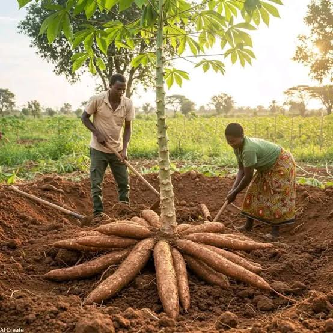
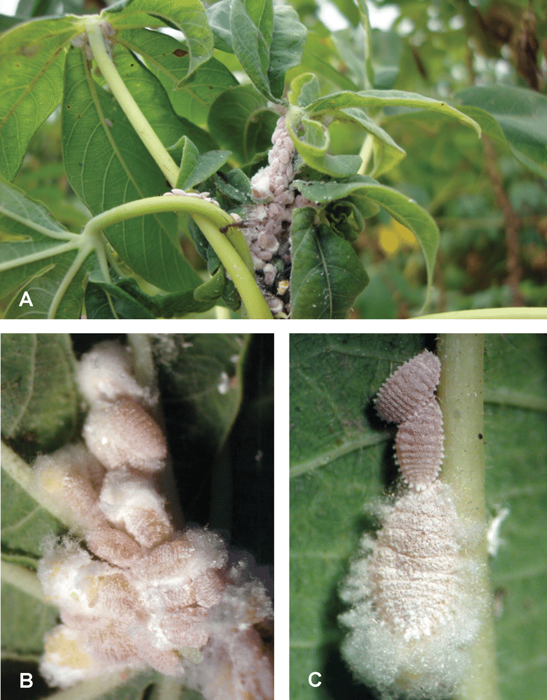
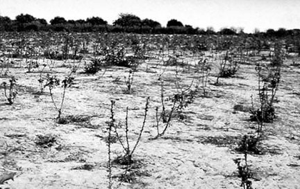
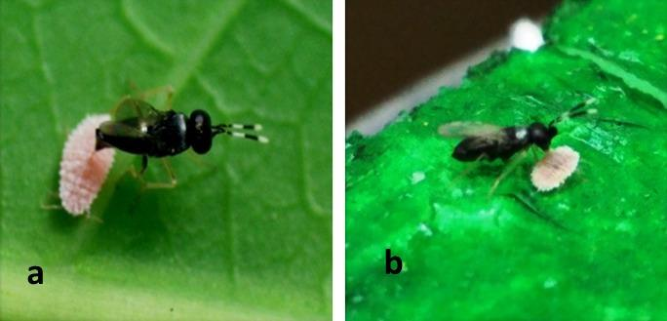

## The Cassava Mealybug {background-color="#1B4332"}

*La cochenille du manioc*

::: {.notes}
Opening story, ~7-8 min. Hook, then crisis, then the search, then the
release, then the outcome, then explicit bridge to "indirect
resistance" / tritrophic interactions as today's theme.
:::

## Last week:
The Great French Wine Blight 
 *la grande crise du phylloxéra*

{width="40%"}

::: {.notes}
Il y a quelques semaines, nous avons rencontré le phylloxéra — un insecte qui a failli détruire tous les vignobles de France.
Any volunteer to summarize the story and explain the solution

Expected answer: grafting onto resistant American rootstock — a direct, plant-only defense. No natural enemy was recruited; humans intervened with horticulture, not biology. Hold that thought — today's story is the mirror image: a defense that runs through a third species entirely.
:::

## Cassava, Mealybug, and Wasp
**Cassava** (*Manihot esculenta*): a root crop, originally domesticated in South America, carried to Africa in 16th century by Portuguese traders.

*Le manioc — une plante d'origine sud-américaine, apportée en Afrique il y a des siècles.*

:::: {.columns}
::: {.column width="60%"}
- By the 20th century, cassava (*Manihot esculenta*) had become a staple for hundreds of millions of people across sub-Saharan Africa.  
  — calorie-dense, drought-tolerant, grows in
  poor soil
:::

::: {.column width="40%"}
{width="80%"}

:::
::::

::: {.notes}
Cassava is drought-tolerant and grows in poor soils, which is exactly why it became so dominant across the cassava belt of sub-Saharan Africa — a crop of last resort that became a crop people depended on.
:::

## 1973. 

:::: {.columns}
::: {.column width="60%"}
Cassava mealybugs (*Phenacoccus manihoti*) arrive in Africa 

Kinshasa (Congo Democratic Republic [Zaire]) and Brazzaville (Republic of Congo)
:::

::: {.column width="40%"}
{width="80%"}

:::
::::

::: {.notes}
The cassava mealybug, Phenacoccus manihoti, was accidentally introduced to Africa — almost certainly on infested planting material brought from South America, where it is native. It arrived without the natural enemies that kept it in check back home.
:::

## What happens next?

Africa's cassava had **never evolved with this insect** 

:::{.notes}
Cassava had never evolved alongside this insect. The mealybug had no natural enemies on this continent. 

Direct structural echo of Week 3's phylloxera story: a
naive host (African cassava) meets a well-adapted invasive pest with
zero coevolutionary history behind it.
:::

## The outbreak

:::: {.columns}
::: {.column width="60%"}
- The mealybug spread across the cassava belt within a decade
- Yield losses of up to 80% in heavily infested fields
- By the early 1980s: a food security crisis for an estimated 200+ million people who depended on cassava as a staple

:::

::: {.column width="40%"}
{width="100%"}

:::
::::

**A single insect, released from its natural enemies, became a continental famine risk.**

*Un seul insecte, libéré de ses ennemis naturels, est devenu un risque de famine à l'échelle du continent.*

::: {.notes}
This is the enemy-release concept in invasion biology, made concrete: an organism introduced without the predators/parasites that regulate it at home can erupt in its new range.
:::

## How can we deal with it?

##
> **A 31-year-old Swiss entomologist arrives in West Africa for a new
> job. He walks straight into a crisis that threatens famine for
> tens of millions of people. 
> - What does he do about
> it?**
>
> *Un entomologiste suisse de 31 ans arrive en Afrique de l'Ouest pour
> un nouveau poste. Il tombe en plein milieu d'une crise qui menace
> la famine pour des dizaines de millions de personnes.  
> - Que fait-il ?*

::: {.notes}
Let guesses land before the reveal. ~1.5 min including setup.
:::

## Hans Rudolf Herren

- Herren, at the International Institute of Tropical Agriculture
  (IITA, Nigeria), reasons:  
  - if the mealybug is from South America,
  its **natural enemies** should be there too
- He searches Central and South America for an insect that
  specifically controls the mealybug back home

{width="50%"}

## The parasitoid wasp
- In South America, Herren's team found a tiny parasitoid wasp, *Anagyrus (Epidinocarsis) lopezi*:  
  - a natural enemy of the cassava mealybug, and 
  - highly specific to it.

*Une minuscule guêpe parasitoïde, ennemi naturel du cotonnet du manioc.*

- The wasp lays its eggs inside mealybugs. Its larvae develop there, eventually killing the host.

{width="100%"}

::: {.notes}
~1.5 min. This is classical biological controls

Host-specificity matters enormously here — releasing a generalist predator across a continent risks unintended ecological damage. Part of what made this program defensible was years of host-specificity testing before any release.
:::

## Release, and recovery

- *Anagyrus lopezi* is mass-reared and released across the African
  cassava belt starting in 1981 
    — one of the largest classical
  biological control efforts ever attempted (eventually spanning dozens of African countries.)
- The wasp establishes and spreads **on its own**, tracking the
  mealybug across the continent without further human help
- Mealybug populations collapsed by more than 90% in treated areas. Cassava yields recovered.

::: {.notes}
The wasp also spread on its own well beyond release sites, following its host — a hallmark of a successful classical biocontrol program: self-sustaining control that doesn't need repeated intervention.
:::

## 1995 World Food Prize

- Hans Rudolf Herren receives the World Food Prize for this work.

*Hans Rudolf Herren reçoit le World Food Prize pour ce travail.*

The program is credited with averting a famine that could have affected tens of millions of people, and saving an estimated tens of billions of dollars in crop value.

::: {.notes}
This is a genuine good-news story in conservation/applied ecology — useful to flag explicitly, since most examples students encounter are about things going wrong.
:::

## How does the wasp find the mealybug?
The mealybug is tiny, cryptic, often hidden in leaf folds. The wasp still finds it, reliably, from a distance.

<!-- 

## We still don't know the exact mechanism

## name after Herren

-->

## 
**Herren didn't make cassava fight back directly  
— he recruited a third party to do the fighting.**

::: {.notes}
~2 min close. Explicit bridge into "indirect resistance" / tritrophic
interactions: recruiting a natural enemy of the herbivore, rather
than resisting the herbivore directly, is this week's whole theme -
Herren's program is a human-engineered version of exactly what
HIPV-signaling plants do chemically later in this lecture.
Source: Herren, H.R. and Neuenschwander, P. (1991). Biological
control of cassava pests in Africa. Annual Review of Entomology.
:::
