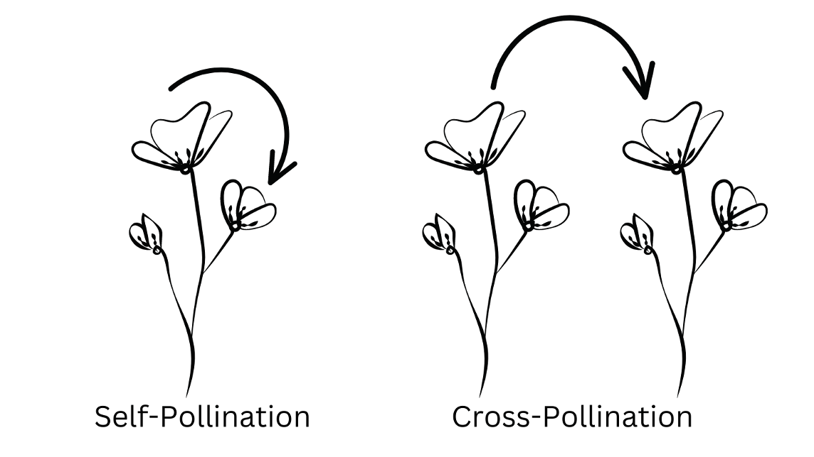
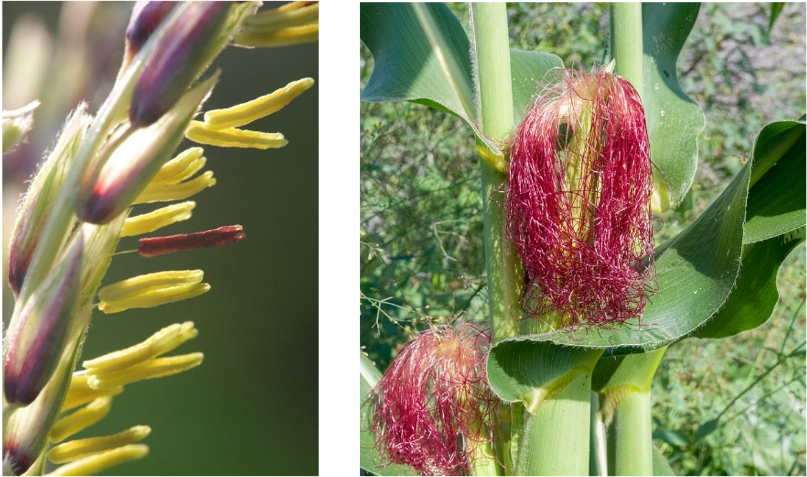
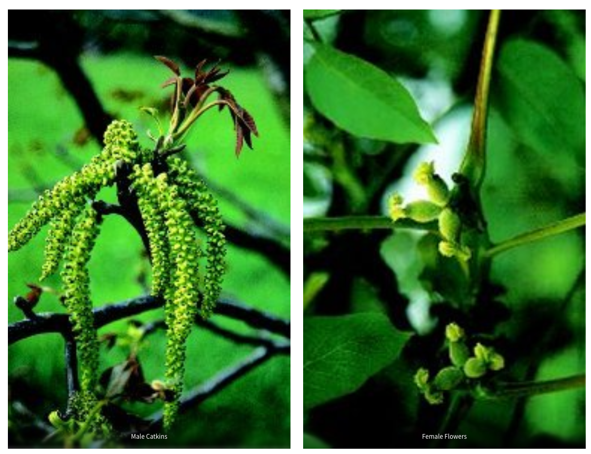
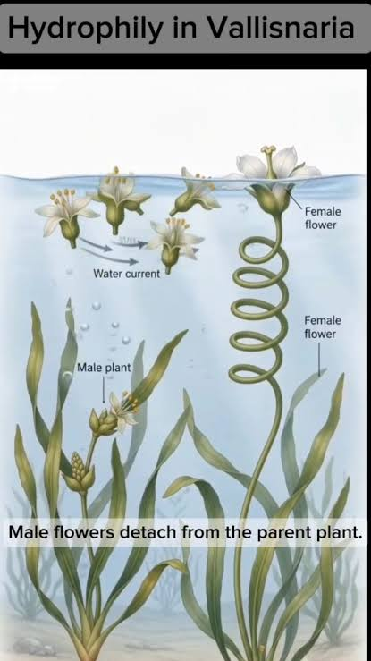
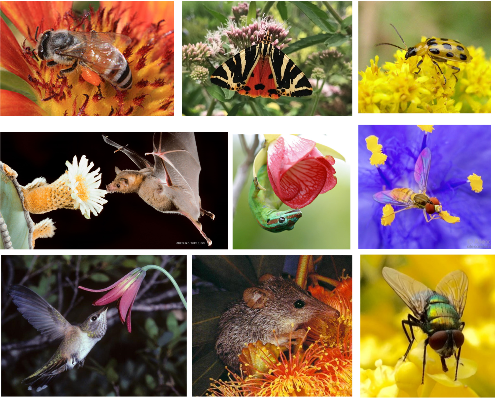
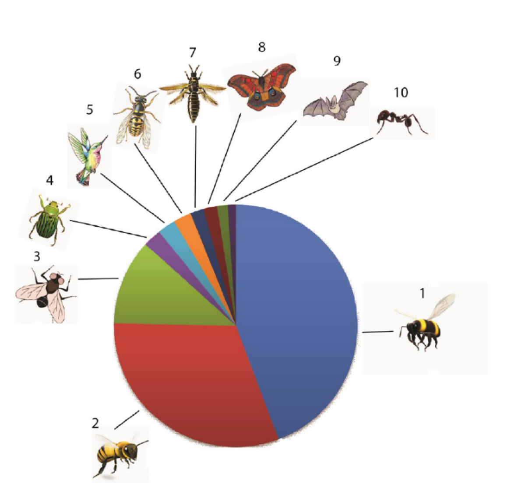

## Pollination {background-color="#1B4332"}

*La pollinisation*

{width="70%" .nostretch}

- Two basic options: **self-pollination** (pollen fertilizes the same
  individual) or **cross-pollination** (pollen moves between
  individuals)

## Selfing vs. outcrossing

::: {.small-text}
| | **Self-pollination** | **Cross-pollination** |
|---|---|---|
| Reliability | Guaranteed — no vector or mate needed | Depends on a vector reaching a compatible mate |
| Cost | Cheap, reproductive assurance | Costly: must attract a vector |
| Genetic aspect | Risk of inbreeding depression | High genetic diversity, adaptable offspring  |
:::

- Many plants actively **avoid** self-pollination: 
  - Dichogamy: temperal separation (anthers and stigma maturing at different times) 
  - Herkogamy: spatial separation within the flower 
  - Self-incompatibility

::: {.notes}
~2 min. The mechanisms preventing selfing are worth naming even
briefly - they show how strongly most plants are investing in
outcrossing despite the cost and unreliability of needing a vector.
:::

## Pollination agents: abiotic

:::: {.columns}
::: {.column width="55%"}
- **Wind** (anemophily)  
  - Grasses (Poaceae, many staple crops):   Maize, Rice, Wheat, Barley, Millet. 
  - Juglandaceae: Walnut, Pecan

- **Water** (hydrophily) 
  - rare, mostly aquatic plants (e.g.
  *Vallisneria*)

> Abiotic pollination is a numbers game: no signaling, no reward, just
  massive overproduction to compensate for how inefficient it is

:::
:::  {.column width="45%"}

{width="42%" .nostretch} 
{width="35%" .nostretch}

{width="50%" .nostretch fig-align="center"}
:::
::::

## Pollination agents: biotic
- ~87% of flowering plant species rely at least partly on an animal
  vector for pollination (Ollerton, Winfree & Tarrant, 2011)

{width="50%" .nostretch fig-align="center"}

## Pollinator diversity
- Relative importance of different animal pollinator groups of most important 101 food crops (Klein et al., 2007):

:::: {.columns}
::: {.column width="35%"}

::: {.small-text}  
1. Bees (excl. Apis); 2. Honeybees; 

3. Flies; 4. Beetles; 

5. Hummingbirds; 6 Wasps; 
7. Thrips; 8. Moths; 
9. Bats; 10. Ants  
:::

:::

::: {.column width="65%"}
{width="60%" .nostretch fig-align="center"}
:::
::::

::: {.notes}
~1.5 min. Bridge directly into "the flower as a marketplace." The 87%
figure is from Ollerton, Winfree & Tarrant (2011) - worth citing if
asked.

- An estimated **87% of flowering plant species** depend on animal
  pollinators — and animal pollination underpins roughly a third of
  global food crop production by value

**Attracting and rewarding a mobile animal is expensive — which is
exactly why the rest of today is about how plants pay for it.**
:::
